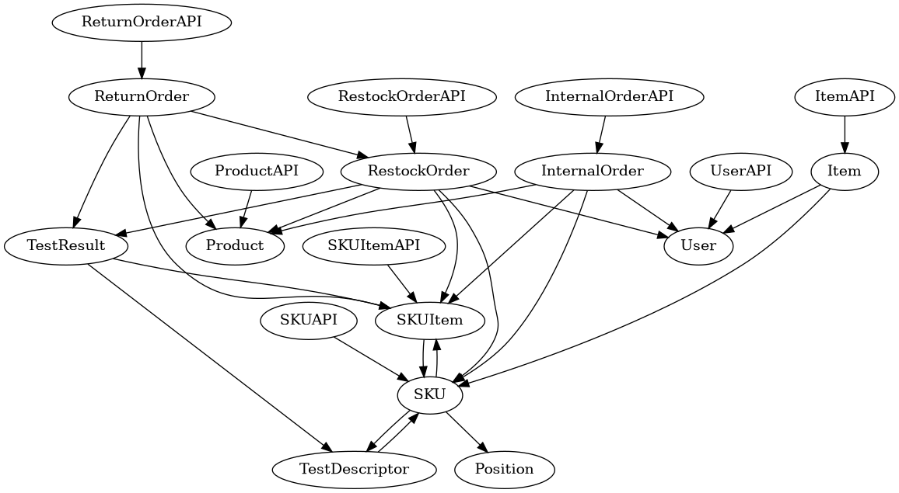

# Integration and API Test Report

Date: 25-05-2022

Version: 1.0

# Contents

- [Dependency graph](#dependency-graph)

- [Integration and API Test Report](#integration-and-api-test-report)
- [Contents](#contents)
- [Dependency graph](#dependency-graph)
- [Integration approach](#integration-approach)
- [Integration Tests](#integration-tests)
  - [Step 1](#step-1)
  - [Step 2](#step-2)
- [Coverage of Scenarios and FR](#coverage-of-scenarios-and-fr)
- [Coverage of Non Functional Requirements](#coverage-of-non-functional-requirements)

- [Tests](#tests)

- [Scenarios](#scenarios)

- [Coverage of scenarios and FR](#scenario-coverage)
- [Coverage of non-functional requirements](#nfr-coverage)

# Dependency graph 

     
# Integration approach

Integration sequence: **Bottom Up**

* **Step 1**: Unit Test of classes
* **Step 2**: API classes tested 

#  Integration Tests

## Step 1
| Classes        | Jest test cases        |
| -------------- | ---------------------- |
| InternalOrder  | internalOrder.test.js  |
| Item           | item.test.js           |
| Position       | position.test.js       |
| RestockOrder   | restockOrder.test.js   |
| ReturnOrder    | returnOrder.test.js    |
| SKU            | sku.test.js            |
| SKUItem        | skuitem.test.js        |
| TestDescriptor | testdescriptor.test.js |
| TestResult     | testresult.test.js     |
| User           | user.test.js           |

## Step 2
| Classes           | mocha test cases  |
| ----------------- | ----------------- |
| InternalOrderAPI  | internalOrder.js  |
| ItemAPI           | item.js           |
| PositionAPI       | position.js       |
| RestockOrderAPI   | restockOrder.js   |
| ReturnOrderAPI    | returnOrder.js    |
| SKUAPI            | sku.js            |
| SKUItemAPI        | skuitem.js        |
| TestDescriptorAPI | testdescriptor.js |
| TestResultAPI     | testresult.js     |
| UserAPI           | user.js           |

# Coverage of Scenarios and FR

| Scenario ID | Functional Requirements covered     | Mocha  Test(s)                                                                                                                    |
| ----------- | ----------------------------------- | --------------------------------------------------------------------------------------------------------------------------------- |
| 1.1         | FR2.1                               | "POST /api/sku"                                                                                                                   |
| 1.2         | FR2.1                               | "PUT /api/sku/:id/position"                                                                                                       |
| 1.3         | FR2.1                               | "PUT /api/sku/:id"                                                                                                                |
| 2.1         | FR3.1.1  FR3.1.4                    | "POST /api/position"                                                                                                              |
| 2.2         | FR3.1.1                             | "PUT /api/position/changeID"                                                                                                      |
| 2.3         | FR3.1.1  FR3.1.4                    | "PUT /api/position"                                                                                                               |
| 2.4         | FR3.1.1  FR3.1.4                    | "PUT /api/position"                                                                                                               |
| 2.5         | FR3.1.2                             | "DELETE /api/position"                                                                                                            |
| 3.2         | FR5.1 FR5.2 FR5.5 FR1.3             | "GET /api/suppliers" "POST /api/restockOrder" "PUT /api/restockOrder/:id/skuItems"                                                |
| 4.1         | FR1.1                               | "POST /api/newUser"                                                                                                               |
| 4.2         | FR1.1                               | "PUT /api/users/:username"                                                                                                        |
| 4.3         | FR1.2                               | "DELETE /api/users/:username/:type"                                                                                               |
| 5.1.1       | FR5.8.1 FR5.8.3 FR5.7               | "POST /api/skuitem" "PUT /api/restockOrder/:id"                                                                                   |
| 5.2.1       | FR3.2.1 FR5.7 FR5.8.2               | "POST /api/skuitems/testResult" "POST /api/skuitem" "PUT /api/restockOrder/:id"                                                   |
| 5.2.2       | FR3.2.1 FR5.7 FR5.8.2               | "POST /api/skuitems/testResult" "POST /api/skuitem" "PUT /api/restockOrder/:id"                                                   |
| 5.2.3       | FR3.2.1 FR5.7 FR5.8.2               | "POST /api/skuitems/testResult" "POST /api/skuitem" "PUT /api/restockOrder/:id"                                                   |
| 5.3.1       | FR5.8.3 FR3.1.4 FR2.1               | "PUT /api/position" "PUT /api/sku/:id"  "POST /api/skuitem"                                                                       |
| 5.3.2       | FR5.7                               | "PUT /api/restockOrder/:id"                                                                                                       |
| 5.3.3       | FR5.8.3 FR3.1.4 FR2.1               | "PUT /api/position" "PUT /api/sku/:id"  "POST /api/skuitem"                                                                       |
| 6.1         | FR5.9 FR5.10 FR6.10                 | "GET /api/skuitems/:rfid/testResults" "DELETE /api/skuitems/:rfid" "POST /api/returnOrder"                                        |
| 6.2         | FR5.9 FR5.10 FR6.10 FR3.1.4 FR2.1   | "GET /api/skuitems/:rfid/testResults" "DELETE /api/skuitems/:rfid" "PUT /api/position" "PUT /api/sku/:id" "POST /api/returnOrder" |
| 7.1         | FR1.5                               | "POST /api/logins"                                                                                                                |
| 7.2         | FR1.5                               | "GET /api/logout"                                                                                                                 |
| 9.1         | FR6.1 FR6.2 FR6.3 FR6.4 FR2.1 FR6.6 | "PUT /api/sku/:id" "POST /api/internalOrders" "PUT /api/internalOrders"                                                           |
| 9.2         | FR6.1 FR6.2 FR6.3 FR6.4 FR2.1 FR6.6 | "PUT /api/sku/:id" "POST /api/internalOrders" "PUT /api/internalOrders"                                                           |
| 9.3         | FR6.1 FR6.2 FR6.3 FR6.4 FR2.1 FR6.6 | "PUT /api/sku/:id" "POST /api/internalOrders" "PUT /api/internalOrders"                                                           |
| 10.1        | FR6.8 FR6.9 FR6.10  FR6.7           | "PUT /api/internalOrders" "GET /api/skus/:id"                                                                                     |
| 11.1        | FR7                                 | "POST /api/item"                                                                                                                  |
| 11.2        | FR7                                 | "PUT /api/item"                                                                                                                   |
| 12.1        | FR3.2.1                             | "POST /api/testDescriptor"                                                                                                        |
| 12.2        | FR3.2.2                             | "PUT /api/testDescriptors/:id"                                                                                                    |
| 12.3        | FR3.2.3                             | "DELETE /api/testDescriptors/:id"                                                                                                 |

# Coverage of Non Functional Requirements

| Non Functional Requirement | Test name                                                                                                           |
| -------------------------- | ------------------------------------------------------------------------------------------------------------------- |
| NFR2                       | All tests in: internalOrder.js, item.js, position.js, sku.js, skuitem.js, testdescriptor.js, testresult.js, user.js |
| NFR4                       | "POST /api/position"                                                                                                |
| NFR6                       | "POST /api/skuitem" "PUT /api/skuitems/:rfid"                                                                       |
| NFR7                       | "POST /api/position" PUT "/api/position/:positionID"                                                                |
| NFR8                       | "POST /api/position" PUT "/api/position/:positionID"                                                                |
| NFR9                       | "POST /api/skuitem" "POST /api/internalOrders" "POST /api/restockOrder" "POST /api/returnOrder"                     |

