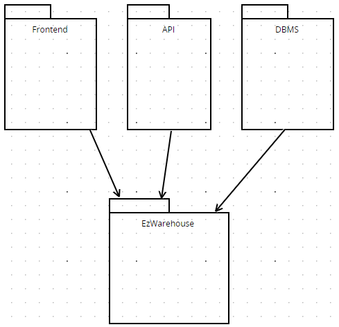
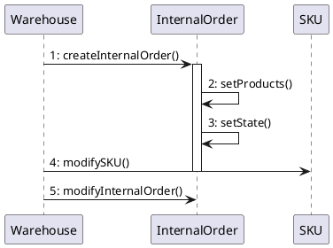
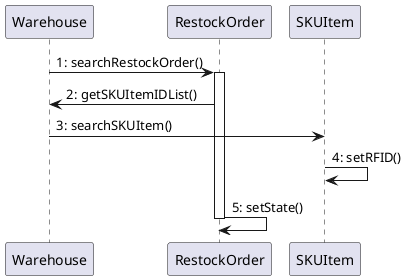
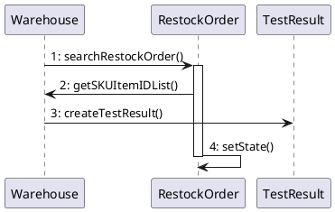
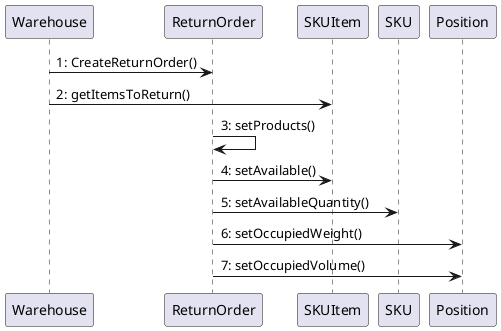

# Design Document 

Authors: Group 55

Version: 1

| Version | Changes | 
| ----------------- |:-----------|
| 1.0 | Finalized first version |
| 1.1 | Edited some methods names |

# Contents

- [Design Document](#design-document)
- [Contents](#contents)
- [Instructions](#instructions)
- [High level design](#high-level-design)
- [Low level design](#low-level-design)
- [Verification traceability matrix](#verification-traceability-matrix)
- [Verification sequence diagrams](#verification-sequence-diagrams)
        - [Scenario 9.1](#scenario-91)
        - [Scenario 5.1.1](#scenario-511)
        - [Scenario 5.2.1](#scenario-521)
        - [Scenario 6.2](#scenario-62)

# Instructions

The design must satisfy the Official Requirements document, notably functional and non functional requirements, and be consistent with the APIs

# High level design 

Architecture: client-server application

Architectural pattern: 3-layered 

# Low level design

```plantuml
@startuml
top to bottom direction
class User {
+ID :int
+Name :string
+Surname :String
+Type :string
+Password :string
+Email :string

+void setType()
+string getName()
+string getSurname()
+string getType()
+string getEmail()
+bool login(String, String, String)
}

class InternalOrder{
+ID :int
+issueDate :date
+state :enum
+productList :list
+customerID :int

+void setIssueDate(string)
+void changeState(string)
+void storeProducts(integer, integer)
+list getProductList()
+date getIssueDate()
}

class SKU{
+ID :int
+description :string
+weight :int
+volume :int
+notes :map
+position :string
+availableQuantity :int
+price :double
+testDescriptorsIDList :list

+void setNotes(string)
+void modifySKUPosition(string)
+void setAvailableQuantity(integer)
+void setPrice(double)
+void setTestDescriptorIDList(list)
+void setWeight(int)
+void setVolume(int)
+void setDescription(int)
}

class SKUItem{
+RFID :string
+SKUID :int
+ItemId :int
+Available :bool
+DateOfStock :date

+void setAvailable(bool)
+void setDateOfStock(date)
+bool getAvailable()
+date getDateOfStock()
}

class Position{
+ID :string
+aisleID :string
+row :string
+col :string
+maxWeight :int
+maxVolume :int
+OccupiedWeight :int
+OccupiedVolume :int

+void setAisleID(string)
+void setRow(string)
+void setCol(string)
+void setMaxWeight(integer)
+void setMaxVolume(integer)
+void setOccupiedWeight(integer)
+void setOccupiedVolume(integer)
+string getAisleID()
+string getRow()
+string getCol()
+int getOccupiedWeight()
+int getOccupiedVolume()
+int getMaxWeight()
+int getMaxVolume()
}

class TestDescriptor{
+ID :int
+name :string
+procedureDescription :string
+idSKU :int

+void setProcedureDescription(string)
+void setSKU(integer)
+void setName(string)
+string getName()
+string getDescription()
}

class TestResult{
+ID :int
+SKUItemID :string
+idTestDescriptor :int
+Date :date
+Result :bool

+bool getResult()
+string getSKUItemID()
}

class ReturnOrder{
+ID :int
+returnDate :date
+productsList :list
+restockOrderID :int

+list getProductsList()
+date getReturnDate()
}

class RestockOrder{
+ID :int
+IssueDate :date
+State :enum
+ProductsList :list
+SupplierID :int
+TransportNote :map
+SKUItemsIDList :id

+void setIssueDate(string)
+void setState(string)
+void setTransportNote(string)
+void setSkuItems(string, integer, integer)
+date getIssueDate()
+list getSKUItemsIDList()
+map getTransportNote()
+enum getState()
+list getProducts()
}

class Item{
+ID :int
+Description :string
+Price :double
+SKUID :int
+SupplierID :int

+void setDescription(string)
+void setPrice(double)
+duble getPrime()
+string getDescription()
}

class Warehouse{
+UsersMap :map
+SuppliersMap :map
+PositionsMap :map
+SKUsMap :map
+SKUsItemsMap :map
+TestDescriptorsMap :map
+TestResultsMap :map
+RestockOrdersMap :map
+InternalOrdersMap :map
}

class WarehouseInterface{
+integer createUser(string, string, string, string, string)
+void deleteUser(integer)
+integer searchUser(string, string, string)
+User[] retrieveUsers()
+void modifyUserRights(integer, string)
+void createSKU(string, integer, integer, string, string, integer, double, integer[])
+void modifySKU(integer, string, i nteger, integer, string, string, integer, double, integer[])
+void modifySKUPosition(integer, string)
+void deleteSKU(integer)
+SKU searchSKU(integer)
+SKU[] retrieveSKUs()
+void createPosition(string, string, string, string, integer, integer)
+void modifyPosition(string, string, string, string, integer, integer, integer, integer)
+void deletePosition(string)
+Position[] retrievePositions()
+void createTestDescriptor(string, string, integer)
+void modifyTestDescriptor(integer, string, string, integer)
+void deleteTestDescriptor(integer)
+TestDescriptor[] retrieveTestDescriptors()
+TestDescriptor searchTestDescriptor(integer)
+void createRestockOrder(string, integer[], integer[], integer[])
+void modifyRestockOrder(integer, integer[], integer[], integer[])
+void changeStateOfRestockOrder(integer, string)
+void addTransportNote(integer, map)
+RestockOrder[] retrieveRestockOrders()
+RestockOrder[] retrieveIssuedRestockOrders()
+RestockOrder searchRestockOrder(integer)
+SKUItem[] getItemsToReturn(integer)
+void deleteRestockOrder(integer)
+void manageReception(integer, bool, string, integer, integer, string)
+void createReturnOrder(string, integer[], integer[], integer)
+ReturnOrder[] getReturnOrders()
+ReturnOrder searchReturnOrder(integer)
+void deleteReturnOrder(integer)
+void createInternalOrder(string, integer[], integer[], integer)
+void modifyInternalOrder(integer, string, integer[], integer[])
+InternalOrder[] retrieveInternalOrders()
+InternalOrder[] retrieveIssuedInternalOrders()
+InternalOrder[] retrieveAcceptedInternalOrders()
+InternalOrder searchInternalOrder(integer)
+void deleteInternalOrder(integer)
+void createSKUItem(string, integer, string)
+void modifySKUItem(string, string, integer, string)
+SKUItem[] retrieveSKUItems()
+SKUItem[] retrieveAvailableSKUItemsFromSKU(integer)
+SKUItem searchSkuItem(string)
+void deleteSKUItem(string)
+void createTestResult(string, integer, string, bool)
+void modifyTestResult(string, integer, integer, string, bool)
+TestResult[] retrieveTestResultsForItem(string)
+TestResult searchTestResult(string, integer)
+void deleteTestResult(string, integer)
+void createItem(string, double, integer, integer)
+void modifyItem(integer, string, double)
+Item[] retrieveItems()
+Item searchItem(integer)
+void deleteItem(integer)
+void manageDelivery(integer[], integer[])
+User login(string, string, string)
+void logout()
}

WarehouseInterface -- "*" Warehouse
Warehouse -- "*" Position
Warehouse -- "*" User
Warehouse -- "*" SKU
Warehouse -- "*" SKUItem
Warehouse -- "*" TestDescriptor
Warehouse -- "*" TestResult
Warehouse -- "*" RestockOrder
Warehouse -- "*" InternalOrder
User -- "*" Item
User -- "*" RestockOrder
RestockOrder -- "*" Item
RestockOrder -- "0..1" ReturnOrder 
RestockOrder -- "*" SKUItem
SKUItem "*" -- "0..1" ReturnOrder
SKU -- "*" SKUItem
SKU -- "*" Item 
SKU "*" -- "*" TestDescriptor
TestDescriptor -- "*" TestResult
SKU "1" -- "1" Position
InternalOrder -- "*" SKU
InternalOrder "0..1" -- "*" SKUItem
SKUItem -- "*" TestResult
SKUItem "*" -- "0..1" Position
User -- "*" InternalOrder 


@enduml
```

# Verification traceability matrix

\<for each functional requirement from the requirement document, list which classes concur to implement it>

|  | User |InternalOrder | SKU | SKUItem | Position | TestDesc | TestResult | Restockorder | returnOrder| Item | Supplier | Warehouse |
| ----------------- |-----------|-----------|-----------|-----------|-----------|-----------|-----------|-----------|-----------|-----------|-----------|-----------|
| FR1 | X |   |   |   |   |   |   |   |   |   |   | X |
| FR2 |   |   | X |   |   |   |   |   |   |   |   | X |
| FR3 |   |   |   |   | X | X | X |   |   |   |   | X |
| FR4 | X |   |   |   |   |   |   |   |   |   |   | X |
| FR5 |   |   | X | X |   |   | X | X | X |   | X | X |
| FR6 |   | X | X | X |   |   |   |   |   |   |   | X |
| FR7 |   |   |   |   |   |   |   |   |   | X | X | X |

# Verification sequence diagrams 

##### Scenario 9.1

##### Scenario 5.1.1

##### Scenario 5.2.1

##### Scenario 6.2

