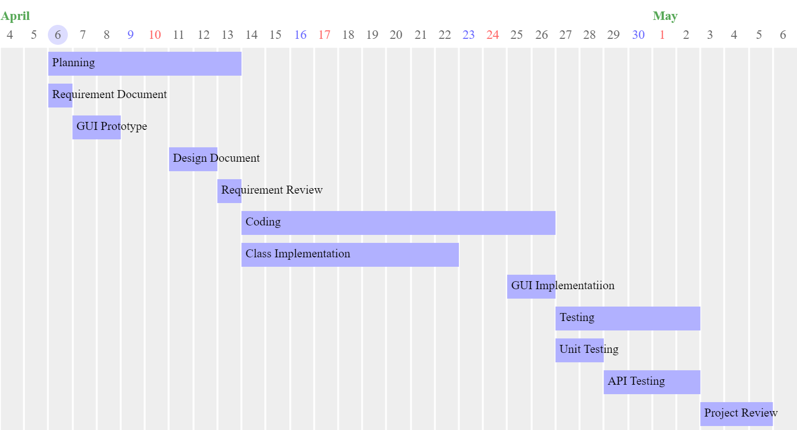

# Project Estimation  
Date: 06/04/2022

Version: 1.0

# Estimation approach
Consider the EZWH  project as described in YOUR requirement document, assume that you are going to develop the project INDEPENDENT of the deadlines of the course
# Estimate by size
### 
|             | Estimate                        |             
| ----------- | ------------------------------- |  
| NC =  Estimated number of classes to be developed   | 10 |             
|  A = Estimated average size per class, in LOC       | 300 | 
| S = Estimated size of project, in LOC (= NC * A) | 3000 |
| E = Estimated effort, in person hours (here use productivity 10 LOC per person hour)  | 300 |   
| C = Estimated cost, in euro (here use 1 person hour cost = 30 euro) | 9000 |
| Estimated calendar time, in calendar weeks (Assume team of 4 people, 8 hours per day, 5 days per week ) | 2 |               

# Estimate by product decomposition
### 
| component name | Estimated effort (person hours) |             
| -------------- | ------------------------------- | 
| requirement document    | 32 |
| GUI prototype | 48 |
| design document | 40 |
| code | 300 |
| unit tests | 64 |
| api tests | 64 |
| management documents  | 20 |

# Estimate by activity decomposition
### 
| Activity name | Estimated effort (person hours) |             
| ------------- | ------------------------------- | 
| Requirement Document | 32 |
| GUI Prototype | 48 |
| Design Document | 40 |
| Requirement Review | 32 |
| Class Implemetation | 236 |
| GUI Implementation | 64 |
| Unit Testing | 64 |
| API Testing | 64 |
| Project Review | 98 |

###

# Summary

Report here the results of the three estimation approaches. The  estimates may differ. Discuss here the possible reasons for the difference

|             | Estimated effort                | Estimated duration |          
| ----------- | ------------------------------- | ------------------ |
| estimate by size | 300 ph | 2 weeks |
| estimate by product decomposition | 568 ph | 3.5 weeks |
| estimate by activity decomposition | 678 ph | 4 weeks |

The differences in estimates depends on the elements considered: 
	estimation by size takes into consideration only the time needed to write the code;
	estimation by product decomposition only counts the person-hours needed to plan, code and test;
	estimation by activity is the only one of the three that considers the time and effort needed for reviewing the plan and the code, intrnally or with the clients.

