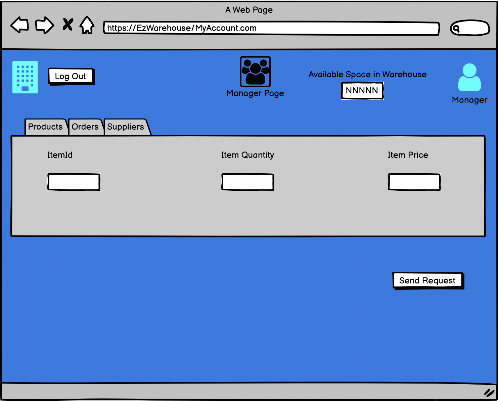
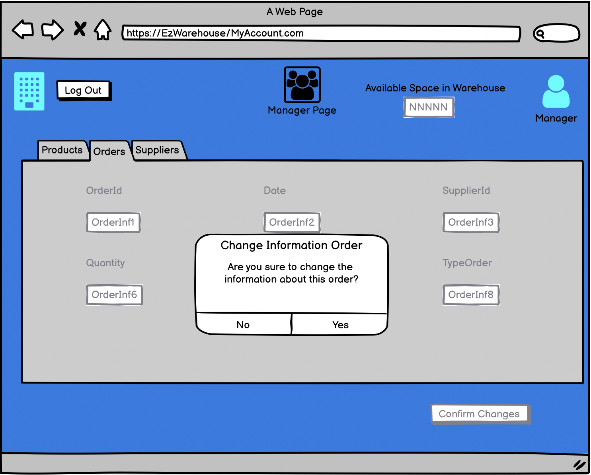
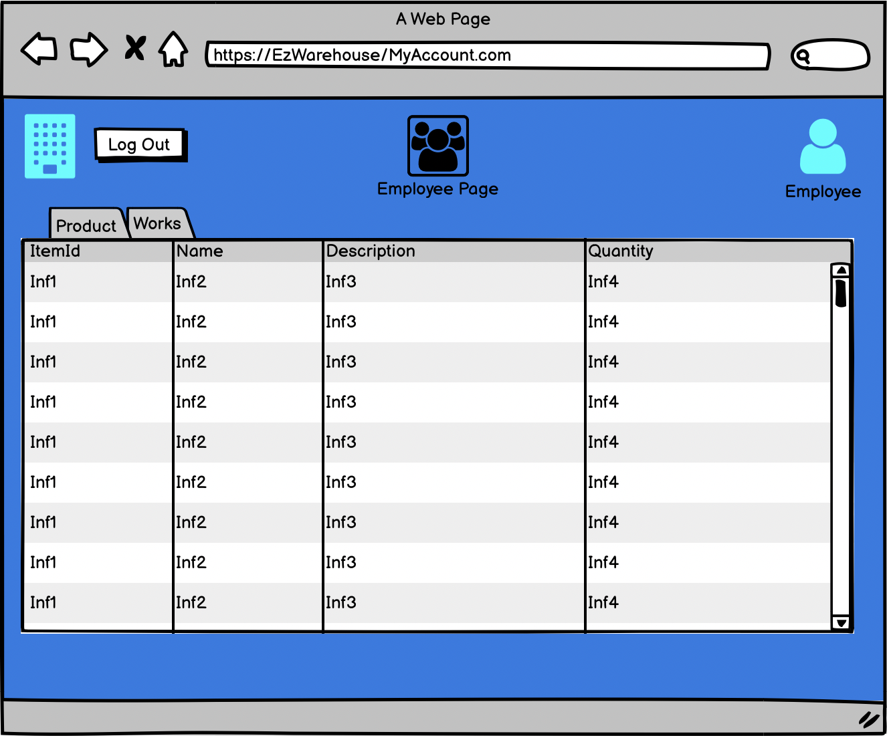
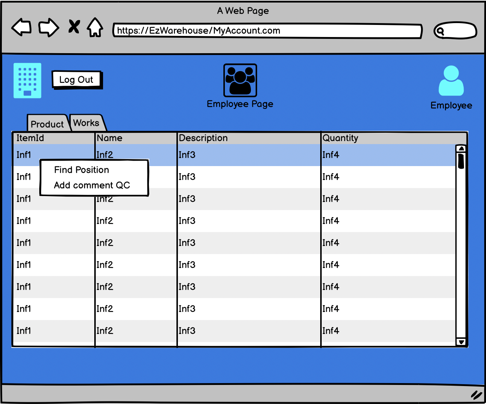
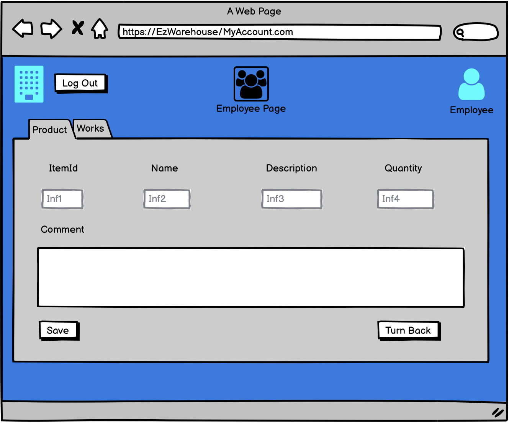
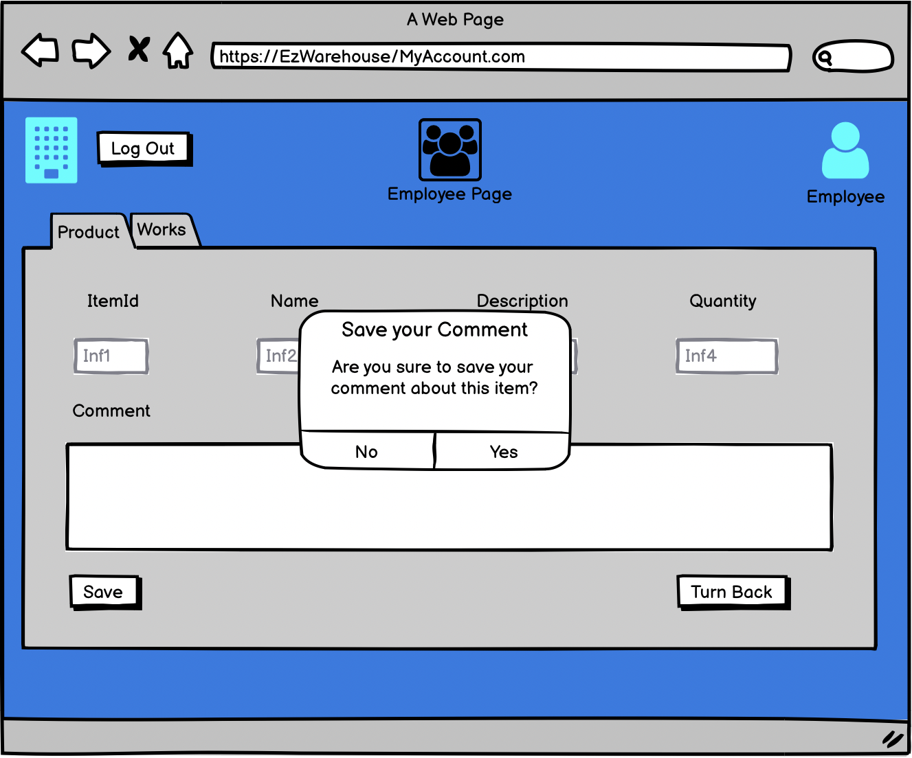
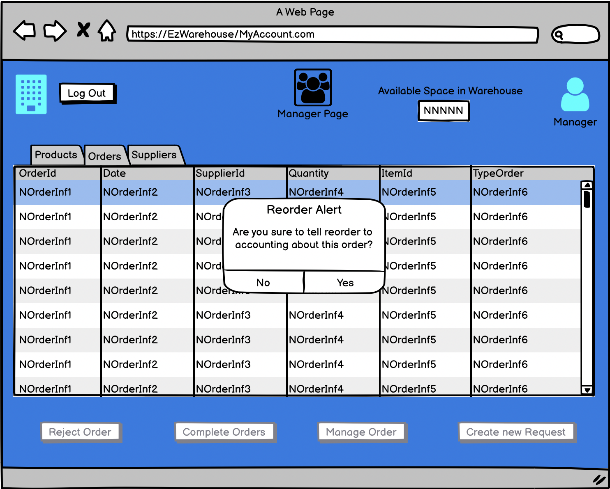
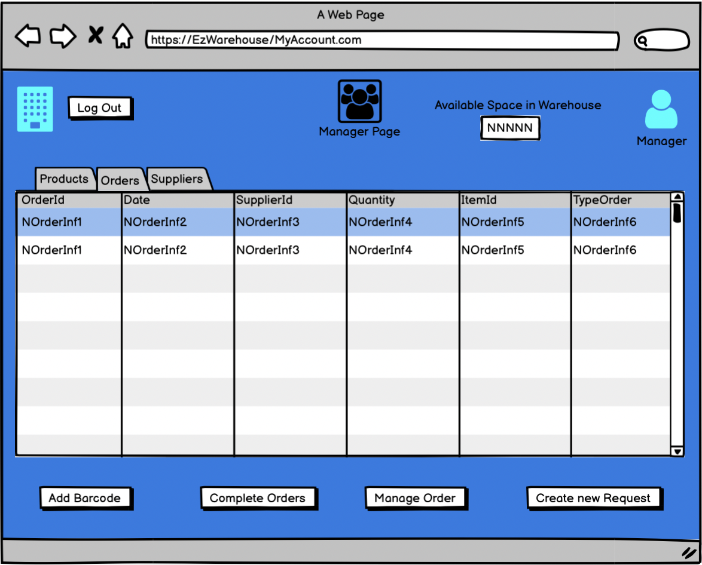

# Graphical User Interface Prototype  

Authors: Group 55

Date: 12/04/2022

Version: 01

### Use case 1, Manage Employee
The Admin is able to select the functionalities that he/she wants to use. The Application displays for each employee some informations.

If the Admin wants to read some details about one employee, he/she can select an employee with right key and then select 'Read User'

The Admin can return to initial page with 'Return to Admin page' button on the right

Other functionality that Admin can make is to search an account by different rules, in this example we use the name of employee

Admin also can modify the account of an employee. Select the user that he/she wants to modify:

Then the Admin press 'Update User' button:

Finally he/she insert the modifications about the employee and the allert will display with a request if to apply or not the modifications about the profile selected

Admin can add a user on the system on pressing the 'Add User' button at the initial page:

Then, after to have inserted all informations, Admin can press the 'Register' button and the alert is shown about if Admin is sure to add this new user:

Finally functionality is about Delete an user. In this case, Admin presses the 'Delete User' button on selecting the profile that will be deleted

Also in this case, the alert is shown

### Use case 2, Manage Order
When a manager try to access to system, he/she will see other functions. This is the first page for a single manager of Warehouse, in particular he/she can see available space in the Warehouse:

The first functionality that he/she requires is the possibility to see catalog of a single supplier selected. In this case, Manager selects a Supplier and, with right key, opens a menu bar with 'See Catalog' function

After he/she presses the menu item, the screen will show the catalog of the supplier

Manager can also make a request to accounting organization to obtain item. To make this, he/she can select the screen for orders and select the 'Send Request' button

After he/she can fill the fields in the request and then Manager can press 'Send Request' button

Finally, the screen will show the summary about filled request

Manager can manage different types of orders. In general, to change informations about an order, he/she can select the order to manage and to press 'Manage Order' button 

The window will show the information about the order and then he/she can edit these informations 

Finally, he/she will see an alert to confirm his/her changes

The last functionality for the Manage, in this Use Case, allows to see the list of suppliers for item supplied. In particular, he/she can use the search box on the right to select the item to see 

Then the system aswers with the list of suppliers that supplied the item choosen

### Use case 3, Manage Quality Check Information 
An Employee with quality checker role in the company can assign comment or result about the process of quality made for the set of products. All the Employees can see this page:

For the role of quality checker, an Employee can set informations thanks to menu that it's possible to open with right key on the single set of item

The Quality Checker Employee select the menu about 'Add Comment QC' and the window will show this screen

Finally, Quality Checker Employee can apply the comment with 'Save' button or to select 'Turn Back' button to return to initial page. In particular, if the Employee selects 'Save' button, the system will show an alert to confirm the changes:

Manager can also sent a request to reorder an item to accounting. To make this, he/she accesses to system in the screen about orders and selects what to reorder. Then he/she can click on 'Create New Request' and, in this case, the system understands that's a reorder question to accounting and sends an alert to confirm this

### Use case 4, Manage Products
In this Use Case, the main content is about "to manage product". An Employee can see the position of a product simply on clicking with righ key on his product screen and then press the menu about "Find Position"

An alert will be generated and the position will be shown

To find a space for incoming item, an Employee can see different works for different orders

For finding a free space for items, an Employee can select the work and then he/she makes right key and select "Find Space Available"

Then the system shows free space in warehouse that it's divided into: Area, Lotto and Columns. In particular, an Employee can select the row returned by system and to click on "Update Space"

The alert will be shown if we want use the position of Warehouse

An OU (Organizational Unit) Employee can request an item to Warehouse. To make this, he/she can have a screen about available items

In order to request an item, an OU Employee can select an item

and then he/she presses "Make an Order" button and an alert with a request quantity is shown

After to have inserted the quantity and confirmed, it will be shown a notification about the order requested

An Employee can also send a notification to Manager to tell that he/she has completed the works about an order. In the window of works, it's present a "Send Summary" button on the right that allows to notify all works completed

A Manager can add a barcode about a product only if the order on the product is completed. To access on completed order, Manager can press "Complete Order" button in Orders Windows

The window makes the possibility to add a barcode by selecting the order and then he/she have to click on "Add Barcode" button

After this step, the information about order will be shown but they are not editable. The barcode depends on the set of item and it's generated automatically with the bar code reader

Finally, he/she can press "Apply Barcode" and an alert will be shown

To reject an Order, Manager can select Orders windows and then select the order. After he/she has selected the order, the Manager can press "Reject Order" and an allert will be shown to confirm operation

A Manager can also modify informations about products in Warehouse. In particular, the modifications can be made in the products window on selecting the item to modify

After to have selected the item, Manager can press "Change Info" button and a new screen will be shown

After editing the fields of products, Manager can press "Confirm changes" button and an alert will be shown

To add a new Product, Manager can access to product screen and then to make right key on the data grid

Then he/she can select the menu item "Add product" and to fill all fields in this new screen

After he/she has completed, Manager can press "Confirm" button and an alert will be shown to confirm the changes

A Manager can also delete a product from the list and, in this case, he/she has to select before the item and then to make right key for selecting "Remove Product"

After this, an alert will be shown to confirm the changes to list

Finally to see space available in Warehouse, the manager can see the window on the left that allows also to edit the information. Another thing that can be usefull to Manager, it's the product list in Warehouse that can be shown with click on products menu

### Use case 5, Manage Suppliers
Manager can see informations about suppliers with the suppliers screen

On this page, he/she can make some operations such as add a new supplier, delete supplier or update a supplier. First operation allows to Manager to add a new supplier with vary informations; in particular he/she have to select 'add supplier' button

After to have inserted these informations, the window will show an alert where to confirm the modification on the supplier list

If the Manager wants, he/she can also delete a supplier. To make this, he/she can select the supplier and presses 'Remove Supplier' button

After this operation, the window will show an alert

Finally, she/he can also update supplier's informations with 'Update Supplier' button. It's need to select the supplier to update and to press on the button

In the last, the window will show an alert about the update

### Use case 6, Authenticate and Authorize
The user can insert his identifier and the password as shown in this page.

If the credentials are wrong, the system asks another times the credentials to user

After insert the correct credentials, the page for the user (in this example for the admin) will be shown. To make logout, the user can click on 'Logout' button near the company icon

