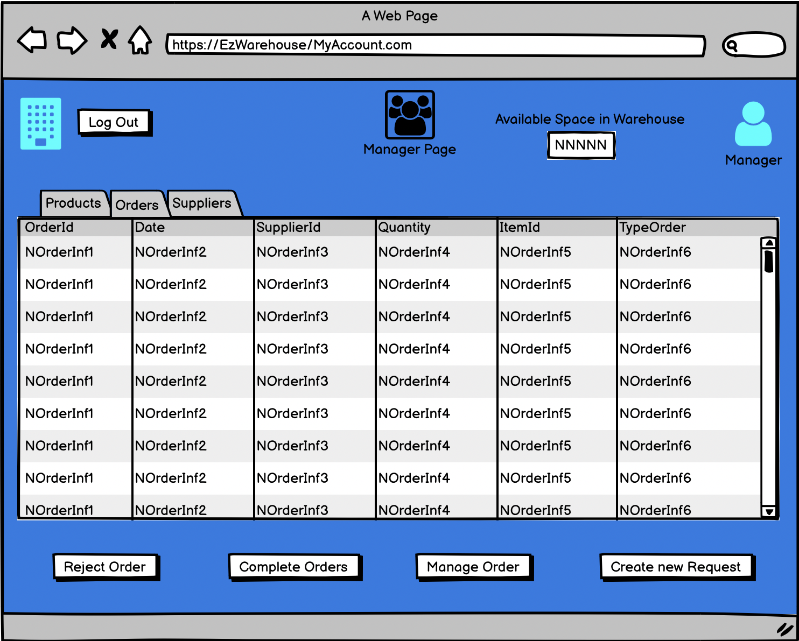
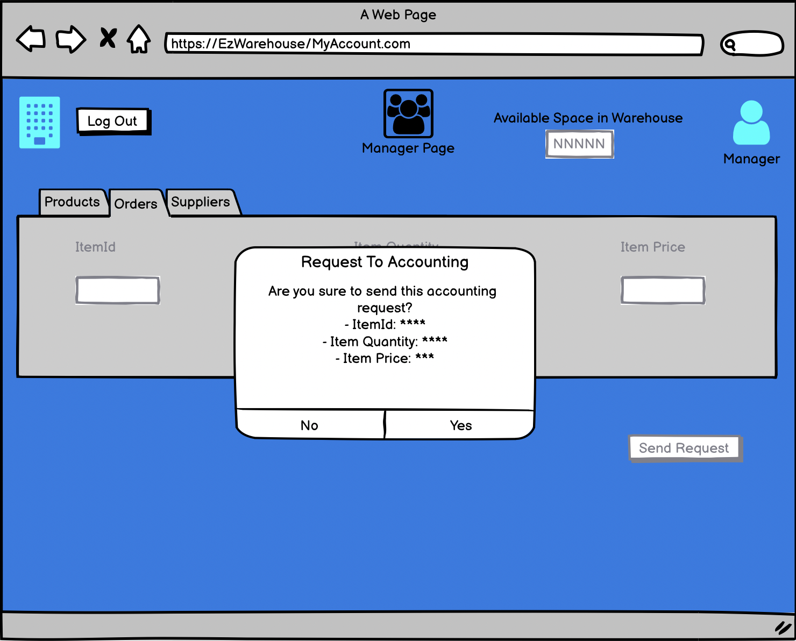
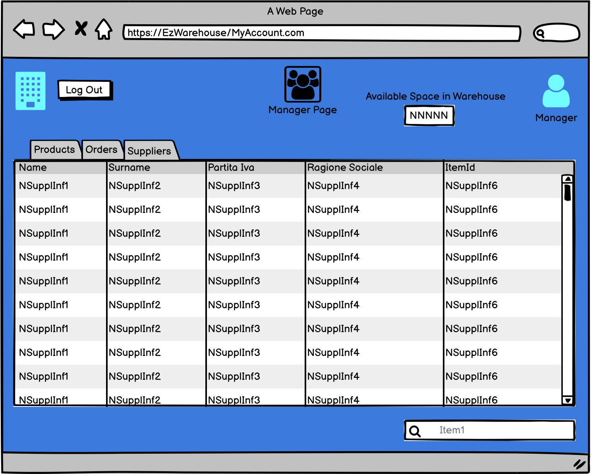

# Graphical User Interface Prototype  

Authors: Group 55

Date: 12/04/2022

Version: 01

### Use case 1, Manage Employee
The Admin is able to select the functionalities that he/she wants to use. The Application displays for each employee some informations.

If the Admin wants to read some details about one employee, he/she can select an employee with right key and then select 'Read User'

The Admin can return to initial page with 'Return to Admin page' button on the right

Other functionality that Admin can make is to search an account by different rules, in this example we use the name of employee

Admin also can modify the account of an employee. Select the user that he/she wants to modify:

Then the Admin press 'Update User' button:

Finally he/she insert the modifications about the employee and the allert will display with a request if to apply or not the modifications about the profile selected

Admin can add a user on the system on pressing the 'Add User' button at the initial page:

Then, after to have inserted all informations, Admin can press the 'Register' button and the alert is shown about if Admin is sure to add this new user:

Finally functionality is about Delete an user. In this case, Admin presses the 'Delete User' button on selecting the profile that will be deleted

Also in this case, the alert is shown

### Use case 2, Manage Order
When a manager try to access to system, he/she will see other functions. This is the first page for a single manager of Warehouse, in particular he/she can see available space in the Warehouse:

The first functionality that he/she requires is the possibility to see catalog of a single supplier selected. In this case, Manager selects a Supplier and, with right key, opens a menu bar with 'See Catalog' function

After he/she presses the menu item, the screen will show the catalog of the supplier

Manager can also make a request to accounting organization to obtain item. To make this, he/she can select the screen for orders and select the 'Send Request' button

After he/she can fill the fields in the request and then Manager can press 'Send Request' button

Finally, the screen will show the summary about filled request

Manager can manage different types of orders. In general, to change informations about an order, he/she can select the order to manage and to press 'Manage Order' button 

The window will show the information about the order and then he/she can edit these informations 

Finally, he/she will see an alert to confirm his/her changes

The last functionality for the Manage, in this Use Case, allows to see the list of suppliers for item supplied. In particular, he/she can use the search box on the right to select the item to see 

Then the system aswers with the list of suppliers that supplied the item choosen

### Use case 3, Manage Quality Check Information 
### Use case 4, Manage Products
### Use case 5, Manage Suppliers
Manager can see informations about suppliers with the suppliers screen

On this page, he/she can make some operations such as add a new supplier, delete supplier or update a supplier. First operation allows to Manager to add a new supplier with vary informations; in particular he/she have to select 'add supplier' button

After to have inserted these informations, the window will show an alert where to confirm the modification on the supplier list

If the Manager wants, he/she can also delete a supplier. To make this, he/she can select the supplier and presses 'Remove Supplier' button

After this operation, the window will show an alert

Finally, she/he can also update supplier's informations with 'Update Supplier' button. It's need to select the supplier to update and to press on the button

In the last, the window will show an alert about the update

### Use case 6, Authenticate and Authorize
The user can insert his identifier and the password as shown in this page.

If the credentials are wrong, the system asks another times the credentials to user

After insert the correct credentials, the page for the user (in this example for the admin) will be shown. To make logout, the user can click on 'Logout' button near the company icon

