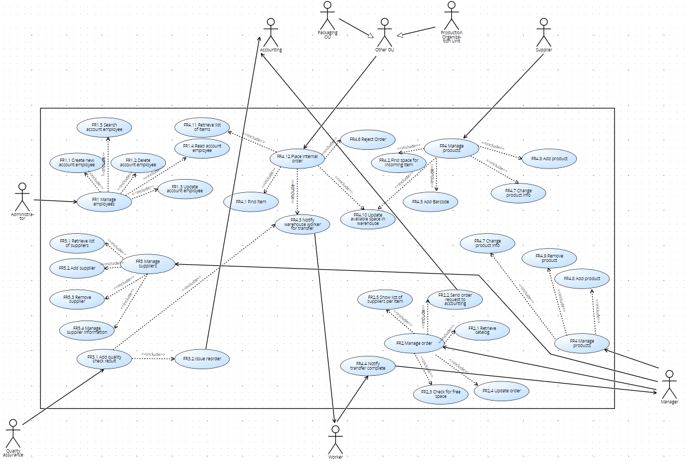
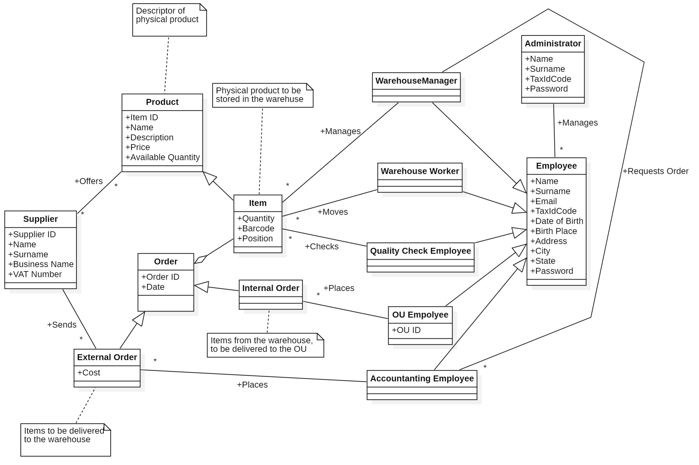

 #Requirements Document 

Date: 13 april 2022

Version: 1.0

 
| Version number | Change |
| ----------------- |:-----------|
| 1.0 | Finalized requirements document first version | 

# Contents

- [Informal description](#informal-description)
- [Stakeholders](#stakeholders)
- [Context Diagram and interfaces](#context-diagram-and-interfaces)
	+ [Context Diagram](#context-diagram)
	+ [Interfaces](#interfaces) 
	
- [Contents](#contents)
- [Informal description](#informal-description)
- [Stakeholders](#stakeholders)
- [Context Diagram and interfaces](#context-diagram-and-interfaces)
	- [Context Diagram](#context-diagram)
	- [Interfaces](#interfaces)
- [Stories and personas](#stories-and-personas)
- [Functional and non functional requirements](#functional-and-non-functional-requirements)
	- [Functional Requirements](#functional-requirements)
	- [Non Functional Requirements](#non-functional-requirements)
- [Use case diagram and use cases](#use-case-diagram-and-use-cases)
	- [Use case diagram](#use-case-diagram)
		- [Use case 1, Manage Employees](#use-case-1-manage-employees)
				- [Scenario 1.1](#scenario-11)
				- [Scenario 1.2](#scenario-12)
				- [Scenario 1.3](#scenario-13)
				- [Scenario 1.4](#scenario-14)
				- [Scenario 1.5](#scenario-15)
		- [Use case 2, Manage Order](#use-case-2-manage-order)
				- [Scenario 2.1](#scenario-21)
				- [Scenario 2.2](#scenario-22)
				- [Scenario 2.3](#scenario-23)
				- [Scenario 2.4](#scenario-24)
				- [Scenario 2.5](#scenario-25)
		- [Use case 3, Manage Quality Check Information](#use-case-3-manage-quality-check-information)
				- [Scenario 3.1](#scenario-31)
				- [Scenario 3.2](#scenario-32)
		- [Use case 4, Manage Products](#use-case-4-manage-products)
				- [Scenario 4.1](#scenario-41)
				- [Scenario 4.2](#scenario-42)
				- [Scenario 4.3](#scenario-43)
				- [Scenario 4.4](#scenario-44)
				- [Scenario 4.5](#scenario-45)
				- [Scenario 4.6](#scenario-46)
				- [Scenario 4.7](#scenario-47)
				- [Scenario 4.8](#scenario-48)
				- [Scenario 4.9](#scenario-49)
				- [Scenario 4.10](#scenario-410)
				- [Scenario 4.11](#scenario-411)
				- [Scenario 4.12](#scenario-412)
		- [Use case 5, Manage Suppliers](#use-case-5-manage-suppliers)
				- [Scenario 5.1](#scenario-51)
				- [Scenario 5.2](#scenario-52)
				- [Scenario 5.3](#scenario-53)
				- [Scenario 5.4](#scenario-54)
		- [Use case 6, Authenticate and Authorize](#use-case-6-authenticate-and-authorize)
				- [Scenario 6.1](#scenario-61)
				- [Scenario 6.2](#scenario-62)
- [Glossary](#glossary)
- [System Design](#system-design)
- [Deployment Diagram](#deployment-diagram)

# Informal description
Medium companies and retailers need a simple application to manage the relationship with suppliers and the inventory of physical items stocked in a physical warehouse. 
The warehouse is supervised by a manager, who supervises the availability of items. When a certain item is in short supply, the manager issues an order to a supplier. In general the same item can be purchased by many suppliers. The warehouse keeps a list of possible suppliers per item. 

After some time the items ordered to a supplier are received. The items must be quality checked and stored in specific positions in the warehouse. The quality check is performed by specific roles (quality office), who apply specific tests for item (different items are tested differently). Possibly the tests are not made at all, or made randomly on some of the items received. If an item does not pass a quality test it may be rejected and sent back to the supplier. 

Storage of items in the warehouse must take into account the availability of physical space in the warehouse. Further the position of items must be traced to guide later recollection of them.

The warehouse is part of a company. Other organizational units (OU) of the company may ask for items in the warehouse. This is implemented via internal orders, received by the warehouse. Upon reception of an internal order the warehouse must collect the requested item(s), prepare them and deliver them to a pick up area. When the item is collected by the other OU the internal order is completed. 

EZWH (EaSy WareHouse) is a software application to support the management of a warehouse.

# Stakeholders

| Stakeholder name  | Description | 
| ----------------- |:-----------:|
|   Administrator     | Handles economic resources for the company mantains relationship with suppliers, manages employees | 
|   Quality Office     |Offices that perform quality check on new items             | 
|   Production Organization Unit     |Area that requests product to warehouse to build something             | 
|   Packaging OU    |Area that packages items for shipping              | 
|   Suppliers     |Who supplies the items requested by company              | 
|   Manager DataBase     |Who manages the database              | 
|   Warehouse Worker    |Person/Machine that moves items around the warehouse             | 
|   Database   |Location to store informations about items, supplier and orders             | 
|   Internal Network     |Network that allows to link different internal organization with warehouse | 
|   Warehouse Manager    | Manages the warehouse, places orders |
|   Accounting   | Manages payments |

# Context Diagram and interfaces

## Context Diagram

## Interfaces

| Actor | Logical Interface | Physical Interface  |
| ------------- |:-------------:| -----:|
| Suppliers | E-mail | Keyboard+Mouse |
| Manager Warehouse | GUI | Keyboard+Mouse/Touchscreen |
| Warehouse Worker | GUI | Touchscreen/Barcode scanner |
| Quality Assurance | GUI | Keyboard+Mouse/Touchscreen |
| Accounting | E-mail | Keyboard+Mouse |
| Administrator | GUI | Keyboard+Mouse |

# Stories and personas

- Marika is the manager of the warehouse, periodically she supervises the availability of items and once an item has low availability, she analyzes the list of the suppliers who provide this item and she performs an order to the one who is the most convenient for the company.

At the end of every day, Marika opens her PC and checks whether to buy a product or not. She wants to place an order quickly and go back home.
Marika decides to buy products that are available in limited quantities by looking at the quantities present and taking into consideration a threshold of necessity for the company. Furthermore, based on the quantity requested by the company, she can decide which supplier to contact to get the best possible discount on the purchase.
Marika is not interested in staying at the office long, so she leaves the work to come back home.

- Matteo is a warehouse employee, his job is to receive notifications from the application to move items and to confirm their movement. 

Every day, he is called upon to respond to requests from an organizational unit within the company. His job will therefore be to recieve a request, move the requested item around, scan the barcode of the item and then update who has received this product. At the end of the day, Matteo can relax because he can log out of the application quickly enough and then happily return home.

- Giacomo is dedicated to test the quality of the items received from the suppliers, picks random items to check their quality and approves/rejects the transfer.

Every day, including holidays, Giacomo applies quality control processes for his company, to guarantee the highest quality for internal products. Sometimes he even decides to take the products home with him to finish his work in the most correct way possible by filling in the supplier's card on his PC and thus informing the administrator about its reliability. The work he does is very tiring but has its advantages with the possibility of giving more space to his family.

# Functional and non functional requirements

## Functional Requirements

| ID        | Description  |
| ------------- |:-------------:| 
|  FR1 | Manage Employees |
|  FR1.1 | Create new account |
|  FR1.2 | Read account |
|  FR1.3 | Update account |
|  FR1.4 | Delete account |
|  FR1.5 | Search account |
|  FR2 | Manage Order |
|  FR2.1 | Retrieve catalog |
|  FR2.2 | Send order request to accounting |
|  FR2.3 | Check for free space |
|  FR2.4 | Update order |
|  FR2.5 | Show list of suppliers for item |
|  FR3 | Manage Quality Check Information |
|  FR3.1 | Add quality check result and comment |
|  FR3.2 | Issue a reorder for product |
|  FR4 | Manage Products |
|  FR4.1 | Find item |
|  FR4.2 | Find space for incoming item |
|  FR4.3 | Notify Warehouse Worker for transfer |
|  FR4.4 | Confirm transfer |
|  FR4.5 | Add barcode |
|  FR4.6 | Reject order |
|  FR4.7 | Change product info |
|  FR4.8 | Add product |
|  FR4.9 | Remove product |
|  FR4.10 | Update available warehouse space |
|  FR4.11 | Retrieve list of items |
|  FR4.12 | Place internal order |
|  FR5 | Manage Suppliers |
|  FR5.1 | Retrieve list of suppliers |
|  FR5.2 | Add supplier |
|  FR5.3 | Remove supplier |
|  FR5.4 | Manage suppliers information |
|  FR6 | Authentication and authorization |
|  FR6.1 | Login |
|  FR6.2 | Logout |

## Non Functional Requirements

| ID        | Type (efficiency, reliability, ..)           | Description  | Refers to |
| ------------- |:-------------:| :-----:| -----:|
|  NFR1     | Usability | Employees are able to use the app after 30 minutes of training; warehouse managers need 1 hour training | All FRs |
|  NFR2     | Privacy | Items locations in warehouse and suppliers information and prices should not be disclosed | FR2, FR4, FR5 |
|  NFR3     | Performance | All internal functions should complete in less than 0.5s | FR1, FR3, FR4, FR6, FR7 |
|  NFR4     | Security | Access only to authorized personnel | All FRs |
|  NFR5     | Domain | Generated barcodes should be unique and 15 digits long | FR4 |

# Use case diagram and use cases

## Use case diagram

### Use case 1, Manage Employees
| Actors Involved        | Administrator  |
| ------------- |:-------------:| 
|  Precondition     | Administrator A logged in  |
|  Post condition     | Account U for Employee E exists |
|  Nominal Scenario     | Administrator A creates (if not existing) a new account for E |
|  Variants     |  U exist already, issue warning|

##### Scenario 1.1 

| Scenario  |  Create new account employee | 
| ----------------- |:-----------:|
|   Precondition     | Administrator A is logged in | 
|		      | Account U of Employee E does not exist |
|   Post condition     | Account U exists | 
|   Step#   | Description   | 
|   1   | A defines the credentials of the new Account U  | 
|   2   | A selects the role for the new account U  |
|   3   | A confirm the inserted data |
|   4   | Account U is added in the system |

##### Scenario 1.2

| Scenario  |  Delete account employee | 
| ----------------- |:-----------:|
|   Precondition     | Administrator A is logged in | 
|		      | Account U of Employee E exists |
|   Post condition     | Account U does not exist | 
|   Step#   | Description   | 
|   1   | A selects Account U  | 
|   2   | A deletes account U  |
|   3   | Account U is deleted in the system |

##### Scenario 1.3

| Scenario  |  Update account employee | 
| ----------------- |:-----------:|
|   Precondition     | Administrator A is logged in | 
|		      | Account U of Employee E exists |
|   Post condition     | Account U.role updated | 
|   Step#   | Description   | 
|   1   | A selects Account U  | 
|   2   | A select which field to update  |
|   3   | A insert the new value |
|   4   | The account U of employee E is modified |

##### Scenario 1.4

| Scenario  |  Read account employee | 
| ----------------- |:-----------:|
|   Precondition     | Administrator A is logged in | 
|		      | Account U of Employee E exists |
|   Post condition     | Account U is shown | 
|   Step#   | Description   | 
|   1   | A selects Account U  | 
|   2   | A asks for U information  |
|   3   | The system show the information related to account U |

##### Scenario 1.5

| Scenario  |  Search an account | 
| ----------------- |:-----------:|
|   Precondition     | Administrator A is logged in | 
|		      | Account U of Employee E exists |
|   Post condition     | Account U is shown | 
|   Step#   | Description   | 
|   1   | A insert rule to search Account U  |  
|   2   | System show the result |

### Use case 2, Manage Order

| Actors Involved        | Manager  |
| ------------- |:-------------:| 
|  Precondition     | Manager M is logged in  |
|  Post condition     |  |
|  Nominal Scenario     | Manager creates new order request for item I. Manager sends order request to accounting |
|  Variants     | Creation of order, item I does not exist, issue warning |
|| Update order O, order does not exist, issue warning |
|| Show list supplier of item I, item I does not exist, issue warning |

##### Scenario 2.1

| Scenario  | Retrieve catalog | 
| ----------------- |:-----------:|
|   Precondition     | Manager M is logged in | 
| 			| Supplier S exists |
|   Post condition     | Catalog C of supplier S is shown | 
|   Step#   | Description   | 
|   1   | Manager M select supplier S | 
|   2   | The system shows Catalog C of supplier S  (ProductID, ProductName, ProductDescription, ProductPrice) |

##### Scenario 2.2

| Scenario  | Send order request to accounting  | 
| ----------------- |:-----------:|
|   Precondition     | Manager M is logged in | 
|   Post condition     | Order request R is sent to accounting | 
|   Step#   | Description   | 
|   1   | Manager M creates new order request R| 
|   2   | M insert item.id and item.price and quantity in the request |
|   3   | M confirm the summary of the order request R |
|  4    | The system send R to accounting |

##### Scenario 2.3

| Scenario  | Check for free space | 
| ----------------- |:-----------:|
|   Precondition     | Manager M is logged in | 
|   Post condition     | SpaceAvailable is shown | 
|   Step#   | Description   | 
|   1   | Manager M asks for SpaceAvailable | 
|   2   | The system shows SpaceAvailable |

##### Scenario 2.4

| Scenario  | Update order | 
| ----------------- |:-----------:|
|   Precondition     | Manager M is logged in | 
|		      | Order O exist |
|   Post condition     | Order O is updated | 
|   Step#   | Description   | 
|   1   | Manager M select order O | 
|   2   | M insert new values in order O fields |
|   3   | Order O is updated|

##### Scenario 2.5

| Scenario  | Show list of suppliers for item | 
| ----------------- |:-----------:|
|   Precondition     | Manager M is logged in | 
|		      | List of supplier L exist |
|		     | item I exist |
|   Post condition     | List L of supplier of item I is shown | 
|   Step#   | Description   | 
|   1   | Manager M select item I | 
|   2   | M select item.L |
|   3   | The system show L to M |

### Use case 3, Manage Quality Check Information 

| Actors Involved        | Quality check employee  |
| ------------- |:-------------:| 
|  Precondition     | Quality check employee QE of quality check office is logged in  |
|  Post condition     | Quality check result and comment recorded in the system |
|  Nominal Scenario     | Quality check employee QE of quality check area performs a test on item I and adds the result of the test together with a comment. |
|  Variants     |  add quality check result of item I, item I does not exist, issue warning|

##### Scenario 3.1

| Scenario  | Add quality check result and comment  | 
| ----------------- |:-----------:|
|   Precondition     | Quality check employee QE of quality office is logged in | 
|		     | item I exist |
|   Post condition     | Quality check result QC of item I is recorded   | 
|   Step#   | Description   | 
|   1   | Quality check employee QE select item I | 
|   2   | QE insert QC |
|   3   | QE insert comment of quality check |
|   4   | Quality check result and comment added in the system |

##### Scenario 3.2

| Scenario  | Issue a reorder for product   | 
| ----------------- |:-----------:|
|   Precondition     | Manager M is logged in | 
|		     | Order O exist |
|		     | items I exist |
|		     | I.TextResult of Order O failed |
|   Post condition     | Notification to accounting sent  | 
|   Step#   | Description   | 
|   1   | Manager M select O | 
|   2   | Manager M notify accounting to ask for replacement |
|   3   | Notification sent to accounting |

### Use case 4, Manage Products

| Actors Involved        |  Warehouse worker, Manager |
| ------------- |:-------------:| 
|  Precondition     |  User U logged in  |
|  Post condition     |  |
|  Nominal Scenario     |  Warehouse worker looks for the place of a certain item. Manager add, delete or update an item |
|  Variants     |  Add new item, the item already exists, Manager modify only the fields|
|| Warehouse worker asks for the place of the item, item does not exist, issue warning |

##### Scenario 4.1

| Scenario  | Find item | 
| ----------------- |:-----------:|
|   Precondition     | Item I exist |
|		      | Warehouse worker W is logged in|
|   Post condition     | Place P is show  |
|   Step#   | Description   | 
|   1   | W Select item I  |
|   2   | W Select I.P  |  
|   3   | Place P of item I is shown |

##### Scenario 4.2

| Scenario  | Find space for incoming item | 
| ----------------- |:-----------:|
|   Precondition     | Item I is arrived | 
|		      | Warehouse worker W is logged in |
|		      | SpaceAvailable>=I.size |
|   Post condition     | Place P is found  |
|   Step#   | Description   | 
|   1   | W select item I  |
|   2   | Select “Find Space” |
|   3   | First available place P is selected by the system |  
|   4   | Place P is linked to I |

##### Scenario 4.3

| Scenario  | Notify Warehouse worker for transfer | 
| ----------------- |:-----------:|
|   Precondition     | OU ordered item I | 
|		      | Item I is available | 
|   Post condition     | Notification sent to Warehouse worker W| 
|   Step#   | Description   | 
|   1   | OU create request of transfer  | 
|   2   | OU insert item in the request |  
|   3   | Notification of request sent to W |

##### Scenario 4.4

| Scenario  | Confirm transfer  | 
| ----------------- |:-----------:|
|   Precondition     | Warehouse worker W is logged in |  
|   Post condition     | Notification transfer complete sent | 
|   Step#   | Description   | 
|   1   | W moves item I | 
|   2   | W confirm transfer |
|   3   | The system sent notification to the Manager  |

##### Scenario 4.5

| Scenario | Add barcode |
| ----------------- |:-----------:|
|   Precondition     | Manager M is logged in | 
|       | Order for item I is placed | 
|   Post condition     | Barcode is added | 
|   Step#   | Description   | 
|   1   | Order is confirmed | 
|   2   | M add Barcode|

##### Scenario 4.6

| Scenario | Reject order |
| ----------------- |:-----------:|
|   Precondition     | Manager M is logged in | 
|       | Organization Unit OU placed order O for item I | 
|   Post condition     | Order O reject | 
|   Step#   | Description   | 
|   1   | M select order O | 
|   2   | M select “reject order” |
|   3   | Order O is rejected |
|   4   | The system sent a notification to OU |

##### Scenario 4.7

| Scenario  |  Change product info  | 
| ----------------- |:-----------:|
|   Precondition     | Manager M is logged in | 
|		      | Item I exist |
|   Post condition     | Info of item I is updated | 
|   Step#   | Description   | 
|   1   | Manager M select item I | 
|   2   | M updates fields of item I |
|   4   | Info of item I are updated  |

##### Scenario 4.8

| Scenario  | Add product | 
| ----------------- |:-----------:|
|   Precondition     | Manager M is logged in | 
|		      | Item I does not exists | 
|   Post condition     | Item I exists | 
|   Step#   | Description   | 
|   1   | M creates item I  | 
|   2   | M populate item I fields |
|   3   | I is recorded in the system |

##### Scenario 4.9

| Scenario  |  Remove product | 
| ----------------- |:-----------:|
|   Precondition     | Manager M is logged in | 
|		      | Item I exists | 
|   Post condition     | Item I does not exists | 
|   Step#   | Description   | 
|   1   | M selects item I  | 
|   2   | M deleted item I |
|   3   | I is deleted in the system |

##### Scenario 4.10

| Scenario  | Update available warehouse space  | 
| ----------------- |:-----------:|
|   Precondition     | Manager M is logged in | 
|   Post condition     | the space available SpaceAvailable is updated | 
|   Step#   | Description   | 
|   1   | M select SpaceAvailable |
|   2   | M insert new value of SpaceAvailable  | 
|   3   | New value of SpaceAvailable updated |

##### Scenario 4.11

| Scenario  | Retrieve list of items | 
| ----------------- |:-----------:|
|   Precondition     | Manager M is logged in | 
|   Post condition     | List of items L is shown | 
|   Step#   | Description   | 
|   1   | Manager M asks for L | 
|   2   | The system shows L (ProductID, ProductName, ProductDescription, ProductPosition, ProductSupplier) |

##### Scenario 4.12

| Scenario  | Place internal order | 
| ----------------- |:-----------:|
|   Precondition     | Organizational Unit OU is logged in | 
|		             | item I exist |
|   Post condition     | Internal Order OI is placed | 
|   Step#   | Description   | 
|   1   | OU creates a new internal order OI |
|   2   | OU select item I | 
|   3   | OU insert quantity <= item.quantity |
|   4   | OU confirm the request |
|   5   | OI is placed |

### Use case 5, Manage Suppliers
| Actors Involved        | Manager  |
| ------------- |:-------------:| 
|  Precondition     | Manager M is logged in |
|  Post condition     |  |
|  Nominal Scenario     | Manager M retrieve the list with all suppliers. Manager M add, delete and update information about suppliers |
|  Variants     |  Add new Supplier, supplier exist, issue warning|
|| Manage a supplier informations, supplier does not exist, issue warning|

##### Scenario 5.1

| Scenario  | Retrieve the list of suppliers | 
| ----------------- |:-----------:|
|   Precondition     | Manager M is logged in | 
|   Post condition     | List L of supplier is shown | 
|   Step#   | Description   | 
|   1   | Manager M asks for List L | 
|   2   | The system shows L |

##### Scenario 5.2

| Scenario  | Add supplier | 
| ----------------- |:-----------:|
|   Precondition     | Manager M is logged in | 
|		      | Supplier S does not exists |
|   Post condition     | Supplier S exist | 
|   Step#   | Description   | 
|   1   | M inputs the supplier informations (name, surname, P_Iva, Ragione Sociale)   | 
|   2   | S is added |

##### Scenario 5.3

| Scenario  | Remove supplier | 
| ----------------- |:-----------:|
|   Precondition     | Manager M is logged in | 
|		      | Supplier S exists |
|   Post condition     | Supplier S does not exist | 
|   Step#   | Description   | 
|   1   | M selects supplier S  | 
|   2   | M deletes supplier S |
|   2   | S is deleted from the system  |

##### Scenario 5.4

| Scenario  | Manage supplier informations | 
| ----------------- |:-----------:|
|   Precondition     | Manager M is logged in | 
|		      | Supplier S exists |
|   Post condition     | Supplier S updated | 
|   Step#   | Description   | 
|   1   | M select supplier S  | 
|   2   | M modifies information of S |
|   3   | S is updated |

### Use case 6, Authenticate and Authorize
| Actors Involved        | Administrator, Warehouse worker, Quality check employee, Manager |
| ------------- |:-------------:| 
|  Precondition     |  |
|  Post condition     |  |
|  Nominal Scenario     | Login: user enters credentials, system checks credentials, user is authenticated |
|  Variants     |  Login, credentials wrong, user not authenticated |
|| Logout |

##### Scenario 6.1

| Scenario  |  Login | 
| ----------------- |:-----------:|
|   Precondition     | Account for user U (Administrator, Quality check employee, Warehouse worker, Manager) existing |  
|   Post condition     | U logged in | 
|   Step#   | Description   | 
|   1   | U insert his ID  | 
|   2   | U insert his password  |
|   3   | U logged in |

| Scenario| Wrong Credentials|
| ------------- |:-------------:| 
|  Precondition     | Account for user U (Administrator, Quality check employee, Warehouse worker, Manager) existing |
|  Post condition     | User has access to data |
| Step#        | Description  |
|  1           | User enters wrong credentials | 
|  2           | System does not give access and asks again for credentials |
| 3            | User types correct credentials |
| 4 		   | System gives access to user 

##### Scenario 6.2

| Scenario  |  Logout | 
| ----------------- |:-----------:|
|   Precondition     | User U logged in|  
|   Post condition     | U logged out | 
|   Step#   | Description   | 
|   1   | U logs out  | 
|   2   | The system show the login page  |

# Glossary

# System Design

# Deployment Diagram

