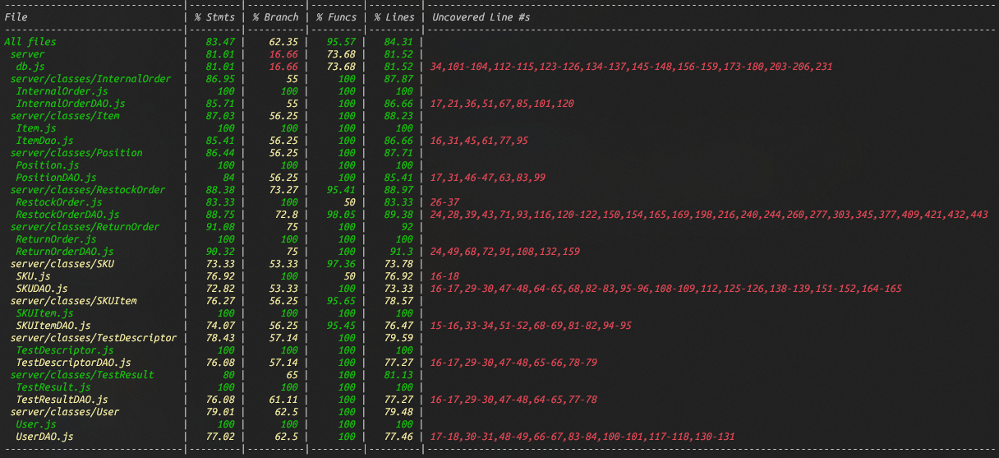

# Unit Testing Report

Date: 25/05/2022

Version: 1.0

# Contents

- [Black Box Unit Tests](#black-box-unit-tests)

- [White Box Unit Tests](#white-box-unit-tests)

# Black Box Unit Tests

## Class SKU

### **Class *SKUDAO* - method *storeSKU***

**Criteria for method *storeSKU*:**

 - Validity object SKU
 - SKU with unique id in database

**Predicates for method *storeSKU*:**

| Criteria                       | Predicate |
| ------------------------------ | --------- |
| Validity object SKU            | Yes       |
|                                | No        |
| SKU with unique id in database | Yes       |
|                                | No        |

**Boundaries**:

| Criteria | Boundary values |
| -------- | --------------- |
|          |                 |
|          |                 |

**Combination of predicates**:

| Validity object SKU | SKU with unique id in database | Valid / Invalid | Description of the test case | Jest test case |
| ------------------- | ------------------------------ | --------------- | ---------------------------- | -------------- |
| Yes                 | Yes                            | Valid           | T1(ValidSKU; True)           | testNewSKU     |  |
| Yes                 | No                             | Invalid         | T2(ValidSKU; False)          |                |  |
| No                  | Yes                            | Invalid         | T3(InvalidSKU; error)        |                |  |
| No                  | No                             | Invalid         | T4(InvalidSKU; error)        |                |  |

### **Class *SKUDAO* - method *getSkus***

**Criteria for method *getSkus*:**
	
 - There are Skus in DB

**Predicates for method *getSkus*:**

| Criteria             | Predicate |
| -------------------- | --------- |
| There are Skus in DB | Yes       |
|                      | No        |

**Boundaries**:

| Criteria | Boundary values |
| -------- | --------------- |
|          |                 |
|          |                 |

**Combination of predicates**:

| There are Skus in DB | Valid / Invalid | Description of the test case | Jest test case |
| -------------------- | --------------- | ---------------------------- | -------------- |
| Yes                  | Valid           | T1((); ListSkus)             | testgetSkus    |
| No                   | Invalid         | T2((); EmptyList)            |                |

### **Class *SKUDAO* - method *getSKUByID***

**Criteria for method *getSKUByID*:**

 - ID is valid

**Predicates for method *getSKUByID*:**

| Criteria    | Predicate |
| ----------- | --------- |
| ID is valid | Yes       |
|             | No        |

**Boundaries**:

| Criteria | Boundary values |
| -------- | --------------- |
|          |                 |
|          |                 |

**Combination of predicates**:

| ID is valid | Valid / Invalid | Description of the test case | Jest test case |
| ----------- | --------------- | ---------------------------- | -------------- |
| Yes         | Valid           | T1(ValidID; SKU)             | testgetSKUByID |
| No          | Invalid         | T2(InvalidID; error)         |                |

### **Class *SKUDAO* - method *getTestDescriptorBySKUID***

**Criteria for method *getTestDescriptorBySKUID*:**

 - There are SkuItems with SKUID in DB

**Predicates for method *getTestDescriptorBySKUID*:**

| Criteria                               | Predicate |
| -------------------------------------- | --------- |
| TestDescriptor with SKUID exists in DB | Yes       |
|                                        | No        |

**Boundaries**:

| Criteria | Boundary values |
| -------- | --------------- |
|          |                 |
|          |                 |

**Combination of predicates**:

| TestDescriptor with SKUID exists in DB | Valid / Invalid | Description of the test case        | Jest test case               |
| -------------------------------------- | --------------- | ----------------------------------- | ---------------------------- |
| Yes                                    | Valid           | T1(ValidSKUIID; TestDescriptorList) | testgetTestDescriptorBySKUID |
| No                                     | Invalid         | T2(InvalidSKUID; EmptyList)         |

### **Class *SKUDAO* - method *updateSKU***

**Criteria for method *updateSKU*:**

 - New SKU is valid
 - ID is valid

**Predicates for method *updateSKU*:**

| Criteria         | Predicate |
| ---------------- | --------- |
| New SKU is valid | Yes       |
|                  | No        |
| ID is valid      | Yes       |
|                  | No        |

**Boundaries**:

| Criteria | Boundary values |
| -------- | --------------- |
|          |                 |
|          |                 |

**Combination of predicates**:

| New SKU is valid | ID is valid | Valid / Invalid | Description of the test case     | Jest test case |
| ---------------- | ----------- | --------------- | -------------------------------- | -------------- |
| Yes              | Yes         | Valid           | T1(ValidSKU, Valid ID; )         | testupdateSKU  |
| Yes              | No          | Invalid         | T2(ValidSKU, InvalidID; error)   |                |
| No               | Yes         | Invalid         | T3(InvalidSKU, ValidID; error)   |                |
| No               | No          | Invalid         | T4(InvalidSKU, InvalidID; error) |                |

### **Class *SKUDAO* - method *updatePositionWeightVolume***

**Criteria for method *updatePositionWeightVolume*:**

 - Weight and Volume values are valid
 - Position ID is valid

**Predicates for method *updatePositionWeightVolume*:**

| Criteria                           | Predicate |
| ---------------------------------- | --------- |
| Weight and Volume values are valid | Yes       |
|                                    | No        |
| Position ID is valid               | Yes       |
|                                    | No        |

**Boundaries**:

| Criteria | Boundary values |
| -------- | --------------- |
|          |                 |
|          |                 |

**Combination of predicates**:

| W and V values are valid | Position ID is valid | Valid / Invalid | Description of the test case                  | Jest test case                 |
| ------------------------ | -------------------- | --------------- | --------------------------------------------- | ------------------------------ |
| Yes                      | Yes                  | Valid           | T1(ValidWeightVolume, ValidPosID; )           | testupdatePositionWeightVolume |
| Yes                      | No                   | Invalid         | T2(ValidWeightVolume, InvalidPosID; error )   |                                |
| No                       | Yes                  | Invalid         | T3(InvalidWeightVolume, ValidPosID; error )   |                                |
| No                       | No                   | Invalid         | T4(InvalidWeightVolume, InvalidPosID; error ) |                                |

### **Class *SKUDAO* - method *PositionOccupied***

**Criteria for method *PositionOccupied*:**

 - Position ID is valid

**Predicates for method *PositionOccupied*:**

| Criteria             | Predicate |
| -------------------- | --------- |
| Position ID is valid | Yes       |
|                      | No        |

**Boundaries**:

| Criteria | Boundary values |
| -------- | --------------- |
|          |                 |
|          |                 |

**Combination of predicates**:

| Position ID is valid | Valid / Invalid | Description of the test case | Jest test case       |
| -------------------- | --------------- | ---------------------------- | -------------------- |
| Yes                  | Valid           | T1(ValidID; Position)        | testPositionOccupied |
| No                   | Invalid         | T2(InvalidID; error)         |                      |

### **Class *SKUDAO* - method *modifySKUPosition***

**Criteria for method *modifySKUPosition*:**

 - New Position is valid
 - Sku ID is valid

**Predicates for method *modifySKUPosition*:**

| Criteria              | Predicate |
| --------------------- | --------- |
| New Position is valid | Yes       |
|                       | No        |
| Sku ID is valid       | Yes       |
|                       | No        |

**Boundaries**:

| Criteria | Boundary values |
| -------- | --------------- |
|          |                 |
|          |                 |

**Combination of predicates**:

| New Position is valid | Sku ID is valid | Valid / Invalid | Description of the test case          | Jest test case        |
| --------------------- | --------------- | --------------- | ------------------------------------- | --------------------- |
| Yes                   | Yes             | Valid           | T1(ValidPosition, ValidID; )          | testupdateSKUPosition |
| Yes                   | No              | Invalid         | T2(ValidPosition, InvalidID; error)   |                       |
| No                    | Yes             | Invalid         | T3(InvalidPosition, ValidID; error)   |                       |
| No                    | No              | Invalid         | T4(InvalidPosition, InvalidID; error) |                       |

### **Class *SKUDAO* - method *existingSKUItem***

**Criteria for method *existingSKUItem*:**

 - SkuItem ID is valid

**Predicates for method *existingSKUItem*:**

| Criteria            | Predicate |
| ------------------- | --------- |
| SkuItem ID is valid | Yes       |
|                     | No        |

**Boundaries**:

| Criteria | Boundary values |
| -------- | --------------- |
|          |                 |
|          |                 |

**Combination of predicates**:

| SkuItem ID is valid | Valid / Invalid | Description of the test case | Jest test case      |
| ------------------- | --------------- | ---------------------------- | ------------------- |
| Yes                 | Valid           | T1(ValidID; Lenght)          | testexistingSKUItem |
| No                  | Invalid         | T2(InvalidID; error)         |                     |

### **Class *SKUDAO* - method *existingTestDescriptor***

**Criteria for method *existingTestDescriptor*:**
 
 - Sku ID is valid
 - TestDescriptor exist

**Predicates for method *existingTestDescriptor*:**

| Criteria             | Predicate |
| -------------------- | --------- |
| TextDescriptor exist | Yes       |
|                      | No        |
| Sku ID is valid      | Yes       |
|                      | No        |

**Boundaries**:

| Criteria | Boundary values |
| -------- | --------------- |
|          |                 |
|          |                 |

**Combination of predicates**:

| TestDescriptor exist | Sku ID is valid | Valid / Invalid | Description of the test case | Jest test case             |
| -------------------- | --------------- | --------------- | ---------------------------- | -------------------------- |
| Yes                  | Yes             | Valid           | T1(ValidID; Lenght)          | testexistingTestDescriptor |
| Yes                  | No              | Invalid         | T2(InvalID; error)           |                            |
| No                   | Yes             | Invalid         | T3(ValidID; )                |                            |
| No                   | No              | Invalid         | T4(InvalidID; error)         |                            |

### **Class *SKUDAO* - method *deleteSKU***

**Criteria for method *deleteSKU*:**

 - Sku ID is valid

**Predicates for method *deleteSKU*:**

| Criteria        | Predicate |
| --------------- | --------- |
| Sku ID is valid | Yes       |
|                 | No        |

**Boundaries**:

| Criteria | Boundary values |
| -------- | --------------- |
|          |                 |
|          |                 |

**Combination of predicates**:

| Sku ID is valid | Valid / Invalid | Description of the test case | Jest test case |
| --------------- | --------------- | ---------------------------- | -------------- |
| Yes             | Valid           | T1(ValidID; )                | testdeleteSKU  |
| No              | Invalid         | T2(InvalidID; error)         |                |

--------------------------------------------------

## Class SkuItem

### **Class *SKUItemDAO* - method *getSKUItems***

**Criteria for method *getSKUItems*:**
	
 - There are SkuItems in DB

**Predicates for method *getSKUItems*:**

| Criteria                 | Predicate |
| ------------------------ | --------- |
| There are SkuItems in DB | Yes       |
|                          | No        |

**Boundaries**:

| Criteria | Boundary values |
| -------- | --------------- |
|          |                 |
|          |                 |

**Combination of predicates**:

| There are SkuItems in DB | Valid / Invalid | Description of the test case | Jest test case  |
| ------------------------ | --------------- | ---------------------------- | --------------- |
| Yes                      | Valid           | T1((); ListSkuItems)         | testgetSKUItems |
| No                       | Invalid         | T2((); EmptyList)            |                 |

### **Class *SKUItemDAO* - method *getArraySKUItemByID***

**Criteria for method *getArraySKUItemByID*:**
	
 - There are SkuItems in DB
 - Available equal to 1
 - Sku ID is valid

**Predicates for method *getArraySKUItemByID*:**

| Criteria                                | Predicate |
| --------------------------------------- | --------- |
| There are SkuItems in DB related to SKU | Yes       |
|                                         | No        |
| Available equal to 1                    | Yes       |
|                                         | No        |
| SKU ID is valid                         | Yes       |
|                                         | No        |

**Boundaries**:

| Criteria             | Boundary values |
| -------------------- | --------------- |
| Available equal to 1 | 0               |
| Available equal to 1 | 2               |

**Combination of predicates**:

| There are SkuItems in DB related to SKU | Available equal to 1 | SKU ID is valid | Valid / Invalid | Description of the test case                                                 | Jest test case  |
| --------------------------------------- | -------------------- | --------------- | --------------- | ---------------------------------------------------------------------------- | --------------- |
| Yes                                     | Yes                  | Yes             | Valid           | T1(ValidID, Available=1; ListSkuItem)                                        | testgetSKUItems |
| Yes                                     | Yes                  | No              | Invalid         | T2(InvalidID, Available=1; error)                                            |                 |
| Yes                                     | No                   | Yes             | Invalid         | T3(ValidID, Available=0; EmptyList)  T4(ValidID, Available=2; EmptyList) |
| Yes                                     | No                   | No              | Invalid         | T5(InvalidID, Available=0; error)  T6(InvalidID, Available=2; error)     |                 |
| No                                      | Yes                  | Yes             | Invalid         | T6(ValidID, Available=1; )                                                   |                 |
| No                                      | Yes                  | No              | Invalid         | T7(InvalidID, Available=1; error )                                           |                 |
| No                                      | No                   | Yes             | Invalid         | T8(InvalidID, Available=0; error)  T9(InvalidID, Available=2; error)     |                 |
| No                                      | No                   | No              | Invalid         | T10(InvalidID, Available=0; error)  T11(InvalidID, Available=2; error)   |                 |

### **Class *SKUItemDAO* - method *getSKUItemByRFID***

**Criteria for method *getSKUItemByRFID*:**

 - RFID is valid

**Predicates for method *getSKUItemByRFID*:**

| Criteria      | Predicate |
| ------------- | --------- |
| RFID is valid | Yes       |
|               | No        |

**Boundaries**:

| Criteria | Boundary values |
| -------- | --------------- |
|          |                 |
|          |                 |

**Combination of predicates**:

| RFID is valid | Valid / Invalid | Description of the test case | Jest test case       |
| ------------- | --------------- | ---------------------------- | -------------------- |
| Yes           | Valid           | T1(ValidRFID; SKUItem)       | testgetSKUItemByRFID |
| No            | Invalid         | T2(InvalidRFID; error)       |                      |

### **Class *SKUItemDAO* - method *storeSKUItem***

**Criteria for method *storeSKUItem*:**

 - Validity object SKUItem
 - SKUItem with unique rfid in database
 - Sku ID is valid

**Predicates for method *storeSKUItem*:**

| Criteria                             | Predicate |
| ------------------------------------ | --------- |
| Validity object SKUItem              | Yes       |
|                                      | No        |
| SKUItem with unique rfid in database | Yes       |
|                                      | No        |
| Sku ID is valid                      | Yes       |
|                                      | No        |

**Boundaries**:

| Criteria | Boundary values |
| -------- | --------------- |
|          |                 |
|          |                 |

**Combination of predicates**:

| Validity object SKUItem | SKUItem with unique rfid in database | SKU ID is valid | Valid / Invalid | Description of the test case           | Jest test case |
| ----------------------- | ------------------------------------ | --------------- | --------------- | -------------------------------------- | -------------- |
| Yes                     | Yes                                  | Yes             | Valid           | T1(ValidData, ValidSKUID; LastID)      | testNewSKUItem |
| Yes                     | Yes                                  | No              | Invalid         | T2(InvalidData,  InvalidSKUID; error ) |                |
| Yes                     | No                                   | Yes             | Invalid         | T3(ValidData, ValidSKUID; error )      |                |
| Yes                     | No                                   | No              | Invalid         | T4(ValidData,  InvalidSKUID; error )   |                |
| No                      | Yes                                  | Yes             | Invalid         | T5(InvalidData,  ValidSKUID; error )   |                |
| No                      | Yes                                  | No              | Invalid         | T6(InvalidData,  InvalidSKUID; error)  |                |
| No                      | No                                   | Yes             | Invalid         | T7(InvalidData,  InvalidSKUID; error ) |                |
| No                      | No                                   | No              | Invalid         | T8(InvalidData,  InvalidSKUID; error)  |                |

### **Class *SKUItemDAO* - method *updateSKUItem***

**Criteria for method *updateSKUItem*:**

 - New SKUItem is valid
 - RFID is valid

**Predicates for method *updateSKUItem*:**

| Criteria             | Predicate |
| -------------------- | --------- |
| New SKUItem is valid | Yes       |
|                      | No        |
| RFID is valid        | Yes       |
|                      | No        |

**Boundaries**:

| Criteria | Boundary values |
| -------- | --------------- |
|          |                 |
|          |                 |

**Combination of predicates**:

| New SKUItem is valid | RFID is valid | Valid / Invalid | Description of the test case           | Jest test case    |
| -------------------- | ------------- | --------------- | -------------------------------------- | ----------------- |
| Yes                  | Yes           | Valid           | T1(ValidSKUItem, ValidRFID;)           | testupdateSKUItem |
| Yes                  | No            | Invalid         | T2(ValidSKUItem,InvalidRFID; error)    |                   |
| No                   | Yes           | Invalid         | T3(InvalidSKUItem, ValidRFID; error)   |                   |
| No                   | No            | Invalid         | T4(InvalidSKUItem, InvalidRFID; error) |                   |

### **Class *SKUItemDAO* - method *deleteSKUItem***

**Criteria for method *deleteSKUItem*:**

 - Skuitem RFID is valid

**Predicates for method *deleteSKUItem*:**

| Criteria              | Predicate |
| --------------------- | --------- |
| Skuitem RFID is valid | Yes       |
|                       | No        |

**Boundaries**:

| Criteria | Boundary values |
| -------- | --------------- |
|          |                 |
|          |                 |

**Combination of predicates**:

| Skuitem RFID is valid | Valid / Invalid | Description of the test case | Jest test case    |
| --------------------- | --------------- | ---------------------------- | ----------------- |
| Yes                   | Valid           | T1(ValidRFID; )              | testdeleteSKUItem |
| No                    | Invalid         | T2(InvalidRFID; error )      |                   |

--------------------------------------------------
## Class RestockOrder

### **Class *RestockOrderDAO* - method *store***
**Criteria:**
 - Validity of object Order
 - *supplierId* is the id of a user of type = 'supplier'

**Predicates:**
|       Criteria        | Predicate |
| --------------------- | --------- |
| Validity of object Order | Yes |
|                          | No |
| *supplierId* is the id of a user of type = 'supplier' | Yes |
|                                                       | No |

**Boundaries:**

**Combination of predicates:**
| Validity of object Order | *supplierId* is the id of a user of type = 'supplier' | Valid / Invalid | Description of the test case | Jest test case |
| ------------------------ | ----------------------------------------------------- | --------------- | ---------------------------- | -------------- |
| Yes                      | Yes                                                   | Valid           | T1(ValidOrder; True)         | testStore      |
| Yes                      | No                                                    | Invalid         | T2(ValidOrder; False)        | testStore      |
| No                       | Yes                                                   | Invalid         | T3(NullOrder; False)         | testStore      |
| No                       | No                                                    | Invalid         | T4(NullOrder; False)         | testStore      |

### **Class *RestockOrderDAO* - method *setState***
**Criteria:**
 - *orderId* refers to an existing Order
 - Validity of *newState*

**Predicates:**
|       Criteria        | Predicate |
| --------------------- | --------- |
| *orderId* refers to an existing Order | Yes |
|                                       | No |
| Validity of *newState* | Yes |
|                        | No |

**Boundaries:**

**Combination of predicates:**
| *orderId* refers to an existing Order | Validity of *newState* | Valid / Invalid | Description of the test case     | Jest test case |
| ------------------------------------- | ---------------------- | --------------- | -------------------------------- | -------------- |
| Yes                                   | Yes                    | Valid           | T1(ValidOrder, ValidState; True) | testSetState   |
| Yes                                   | No                     | Invalid         | T2(ValidOrder, NullState; False) | testSetState   |
| No                                    | Yes                    | Invalid         | T3(NullOrder, ValidState; False) | testSetState   |
| No                                    | No                     | Invalid         | T4(NullOrder, NullState; False)  | testSetState   |

### **Class *RestockOrderDAO* - method *setSkuItems***
**Criteria:**
 - *orderId* refers to a delivered Order
 - Validity of *skuItems*

**Predicates:**
|       Criteria        | Predicate |
| --------------------- | --------- |
| *orderId* refers to a delivered Order | Yes |
|                                       | No |
| Validity of *skuItems* | Yes |
|                        | No |

**Boundaries:**

**Combination of predicates:**
| *orderId* refers to a delivered Order | Validity of *skuItems* | Valid / Invalid | Description of the test case     | Jest test case    |
| ------------------------------------- | ---------------------- | --------------- | -------------------------------- | ----------------- |
| Yes                                   | Yes                    | Valid           | T1(ValidOrder, ValidItems; True) | testSetSkuItems   |
| Yes                                   | No                     | Invalid         | T2(ValidOrder, NullItems; False) | testSetSkuItems   |
| No                                    | Yes                    | Invalid         | T3(NullOrder, ValidItems; False) | testSetSkuItems   |
| No                                    | No                     | Invalid         | T4(NullOrder, NullItems; False)  | testSetSkuItems   |

### **Class *RestockOrderDAO* - method *setTransportNote***
**Criteria:**
 - *orderId* refers to an Order to be deliverd
 - Validity of *transportNote*

**Predicates:**
|       Criteria        | Predicate |
| --------------------- | --------- |
| *orderId* refers to an Order to be deliverd | Yes |
|                                             | No |
| Validity of *transportNote* | Yes |
|                             | No |

**Boundaries:**

**Combination of predicates:**
| *orderId* refers to an Order to be deliverd | Validity of *transportNote* | Valid / Invalid | Description of the test case    | Jest test case         |
| ------------------------------------------- | --------------------------- | --------------- | ------------------------------- | ---------------------- |
| Yes                                         | Yes                         | Valid           | T1(ValidOrder, ValidNote; True) | testSetTransportNote   |
| Yes                                         | No                          | Invalid         | T2(ValidOrder, NullNote; False) | testSetTransportNote   |
| No                                          | Yes                         | Invalid         | T3(NullOrder, ValidNote; False) | testSetTransportNote   |
| No                                          | No                          | Invalid         | T4(NullOrder, NullNote; False)  | testSetTransportNote   |

### **Class *RestockOrderDAO* - method *getAll***
**Criteria:**
 - There are orders in DB

**Predicates:**
|       Criteria         | Predicate |
| ---------------------- | --------- |
| There are orders in DB | Yes |
|                        | No |

**Boundaries:**

**Combination of predicates:**
| There are orders in DB | Valid / Invalid | Description of the test case | Jest test case |
| ---------------------- | --------------- | ---------------------------- | -------------- |
| Yes                    | Valid           | T1((); True)           | testGetAll      |
| No                     | Valid           | T2((); True)           |  |

### **Class *RestockOrderDAO* - method *getIssued***
**Criteria:**
 - There are orders in DB with *state* 'ISSUED'
 - Some orders have *state* 'ISSUED'

**Predicates:**
|       Criteria         | Predicate |
| ---------------------- | --------- |
| There are orders in DB with *state* 'ISSUED' | Yes |
|                                              | No |

**Boundaries:**

**Combination of predicates:**
| There are orders in DB with *state* 'ISSUED' | Valid / Invalid | Description of the test case | Jest test case |
| -------------------------------------------- | --------------- | ---------------------------- | -------------- |
| Yes                                          | Valid           | T1((); True)        | testGetIssued  |
| No                                           | Valid           | T2((); True)        |  |

### **Class *RestockOrderDAO* - method *get***
**Criteria:**
 - *orderId* refers to an existing Order

**Predicates:**
|       Criteria         | Predicate |
| ---------------------- | --------- |
| *orderId* refers to an existing Order | Yes |
|                                       | No |

**Boundaries:**

**Combination of predicates:**
| *orderId* refers to an existing Order | Valid / Invalid | Description of the test case | Jest test case |
| ------------------------------------- | --------------- | ---------------------------- | -------------- |
| Yes                                   | Valid           | T1(ValidOrderId; True)       | testGet |
| No                                   | Invalid          | T2(InvalidOrderId; False)    | testGet |

### **Class *RestockOrderDAO* - method *getReturnItems***
**Criteria:**
 - *orderId* refers to an existing Order with *state* 'COMPLETEDRETURN'

**Predicates:**
|       Criteria         | Predicate |
| ---------------------- | --------- |
| *orderId* refers to an existing Order with *state* 'COMPLETEDRETURN' | Yes |
|                                       | No |

**Boundaries:**

**Combination of predicates:**
| *orderId* refers to an existing Order with *state* 'COMPLETEDRETURN' | Valid / Invalid | Description of the test case | Jest test case |
| ------------------------------------- | --------------- | ---------------------------- | -------------- |
| Yes                                   | Valid           | T1(ValidOrderId; True)       | testGetReturnItems |
| No                                   | Invalid           | T2(InvalidOrderId; False)    | testGetReturnItems |

### **Class *RestockOrderDAO* - method *delete***
**Criteria:**
 - *orderId* refers to an existing Order

**Predicates:**
|       Criteria         | Predicate |
| ---------------------- | --------- |
| *orderId* refers to an existing Order | Yes |
|                                       | No |

**Boundaries:**

**Combination of predicates:**
| *orderId* refers to an existing Order | Valid / Invalid | Description of the test case | Jest test case |
| ------------------------------------- | --------------- | ---------------------------- | -------------- |
| Yes                                   | Valid           | T1(ValidOrderId; True)       | testDelete |
| No                                   | Invalid           | T2(InvalidOrderId; False)    | testDelete |

--------------------------------------------------
## Class ReturnOrder

### **Class *ReturnOrderDAO* - method *store***
**Criteria:**
 - Validity of object Order
 - *restockOrderId* refers to an existing RestockOrder

**Predicates:**
|       Criteria        | Predicate |
| --------------------- | --------- |
| Validity of object Order | Yes |
|                          | No |
| *restockOrderId* refers to an existing RestockOrder | Yes |
|                                                     | No |

**Boundaries:**

**Combination of predicates:**
| Validity of object Order | *restockOrderId* refers to an existing RestockOrder | Valid / Invalid | Description of the test case | Jest test case |
| ------------------------ | ----------------------------------------------------- | --------------- | ---------------------------- | -------------- |
| Yes                      | Yes                                                   | Valid           | T1(ValidOrder; True)         | testStore      |
| Yes                      | No                                                    | Invalid         | T2(ValidOrder; False)        | testStore      |
| No                       | Yes                                                   | Invalid         | T3(NullOrder; False)         | testStore      |
| No                       | No                                                    | Invalid         | T4(NullOrder; False)         | testStore      |

### **Class *ReturnOrderDAO* - method *getAll***
**Criteria:**
 - There are orders in DB

**Predicates:**
|       Criteria         | Predicate |
| ---------------------- | --------- |
| There are orders in DB | Yes |
|                        | No |

**Boundaries:**

**Combination of predicates:**
| There are orders in DB | Valid / Invalid | Description of the test case | Jest test case |
| ---------------------- | --------------- | ---------------------------- | -------------- |
| Yes                    | Valid           | T1((); True)        | testGetAll     |
| No                     | Valid           | T2((); True)           |  |

### **Class *ReturnOrderDAO* - method *get***
**Criteria:**
 - *orderId* refers to an existing Order

**Predicates:**
|       Criteria         | Predicate |
| ---------------------- | --------- |
| *orderId* refers to an existing Order | Yes |
|                                       | No |

**Boundaries:**

**Combination of predicates:**
| *orderId* refers to an existing Order | Valid / Invalid | Description of the test case | Jest test case |
| ------------------------------------- | --------------- | ---------------------------- | -------------- |
| Yes                                   | Valid           | T1(ValidOrderId; True)       | testGet |
| No                                    | Invalid           | T2(InvalidOrderId; False)    | testGet |

### **Class *ReturnOrderDAO* - method *delete***
**Criteria:**
 - *orderId* refers to an existing Order

**Predicates:**
|       Criteria         | Predicate |
| ---------------------- | --------- |
| *orderId* refers to an existing Order | Yes |
|                                       | No |

**Boundaries:**

**Combination of predicates:**
| *orderId* refers to an existing Order | Valid / Invalid | Description of the test case | Jest test case |
| ------------------------------------- | --------------- | ---------------------------- | -------------- |
| Yes                                   | Valid           | T1(ValidOrderId; True)       | testDelete |
| No                                   | Invalid           | T2(InvalidOrderId; False)    | testDelete |

--------------------------------------------------
## Class User

 ### **Class *UserDAO* - method *storeUser***

**Criteria for method *storeUser*:**

 - Validity object User
 - User with unique email in database

**Predicates for method *storeUser*:**

| Criteria                           | Predicate |
| ---------------------------------- | --------- |
| Validity object User               | Yes       |
|                                    | No        |
| User with unique email in database | Yes       |
|                                    | No        |

**Boundaries**:

| Criteria | Boundary values |
| -------- | --------------- |
|          |                 |
|          |                 |

**Combination of predicates**:

| Validity object User | User with unique id in database | Valid / Invalid | Description of the test case | Jest test case |
| -------------------- | ------------------------------- | --------------- | ---------------------------- | -------------- |
| Yes                  | Yes                             | Valid           | T1(ValidUser; True)          | testNewUser    |
| Yes                  | No                              | Invalid         | T2(ValidUser; False)         |                |
| No                   | Yes                             | Invalid         | T3(NullUser; False)          |                |
| No                   | No                              | Invalid         | T4(NullUser; False)          |                |

 ### **Class *UserDAO* - method *getUsers***

**Criteria for method *getUsers*:**

 - There are Users in DB

**Predicates for method *getUsers*:**

| Criteria              | Predicate |
| --------------------- | --------- |
| There are Users in DB | Yes       |
|                       | No        |

**Boundaries**:

| Criteria | Boundary values |
| -------- | --------------- |
|          |                 |
|          |                 |

**Combination of predicates**:

| There are Users in DB | Valid / Invalid | Description of the test case | Jest test case |
| --------------------- | --------------- | ---------------------------- | -------------- |
| Yes                   | Valid           | T1((); ListUsers)            | getUsers       |
| No                    | Invalid         | T2((); EmptyList)            |                |

 ### **Class *UserDAO* - method *getSuppliers***

**Criteria for method *getSuppliers*:**

 - There are Suppliers in DB

**Predicates for method *getSuppliers*:**

| Criteria                  | Predicate |
| ------------------------- | --------- |
| There are Suppliers in DB | Yes       |
|                           | No        |

**Boundaries**:

| Criteria | Boundary values |
| -------- | --------------- |
|          |                 |
|          |                 |

**Combination of predicates**:

| There are Suppliers in DB | Valid / Invalid | Description of the test case | Jest test case |
| ------------------------- | --------------- | ---------------------------- | -------------- |
| Yes                       | Valid           | T1((); ListUsers)            | getSuppliers   |
| No                        | Invalid         | T2((); EmptyList)            |                |

 ### **Class *UserDAO* - method *login***

**Criteria for method *login*:**

 - Validity of tuple username, password
 - User exists in db with correct type

**Predicates for method *login*:**

| Criteria                             | Predicate |
| ------------------------------------ | --------- |
| Validity of tuple username, password | Yes       |
|                                      | No        |
| User exists in db with correct type  | Yes       |
|                                      | No        |

**Boundaries**:

| Criteria | Boundary values |
| -------- | --------------- |
|          |                 |
|          |                 |

**Combination of predicates**:

| Validity of tuple username, password | User exists in db with correct type | Valid / Invalid | Description of the test case      | Jest test case |
| ------------------------------------ | ----------------------------------- | --------------- | --------------------------------- | -------------- |
| Yes                                  | Yes                                 | Valid           | T1(ValidUsernamePassword; User)   | login          |
| Yes                                  | No                                  | Invalid         | T2(ValidUsernamePassword; Null)   |                |
| No                                   | Yes                                 | Invalid         | T3(InvalidUsernamePassword; Null) |                |
| No                                   | No                                  | Invalid         | T4(InvalidUsernamePassword; Null) |                |

 ### **Class *UserDAO* - method *getUserFromId***

**Criteria for method *getUserFromId*:**

 - ID is of a valid user

**Predicates for method *getUserFromId*:**

| Criteria              | Predicate |
| --------------------- | --------- |
| ID is of a valid user | Yes       |
|                       | No        |

**Boundaries**:

| Criteria | Boundary values |
| -------- | --------------- |
|          |                 |
|          |                 |

**Combination of predicates**:

| ID is of a valid user | Valid / Invalid | Description of the test case | Jest test case |
| --------------------- | --------------- | ---------------------------- | -------------- |
| Yes                   | Valid           | T1(ValidID; User)            | getUserFromId  |
| No                    | Invalid         | T2(InvalidID; Null)          |                |

 ### **Class *UserDAO* - method *getUserFromEmail***

**Criteria for method *getUserFromEmail*:**

 - email is of a valid user

**Predicates for method *getUserFromEmail*:**

| Criteria                 | Predicate |
| ------------------------ | --------- |
| email is of a valid user | Yes       |
|                          | No        |

**Boundaries**:

| Criteria | Boundary values |
| -------- | --------------- |
|          |                 |
|          |                 |

**Combination of predicates**:

| email is of a valid user | Valid / Invalid | Description of the test case | Jest test case   |
| ------------------------ | --------------- | ---------------------------- | ---------------- |
| Yes                      | Valid           | T1(ValidEmail; User)         | getUserFromEmail |
| No                       | Invalid         | T2(InvalidEmail; Null)       |                  |

 ### **Class *UserDAO* - method *updateUser***

**Criteria for method *updateUser*:**

 - ID is of a valid user
 - newType is valid

**Predicates for method *updateUser*:**

| Criteria              | Predicate |
| --------------------- | --------- |
| ID is of a valid user | Yes       |
|                       | No        |
| newType is valid      | Yes       |
|                       | No        |

**Boundaries**:

| Criteria | Boundary values |
| -------- | --------------- |
|          |                 |
|          |                 |

**Combination of predicates**:

| ID is of a valid user | newType is valid | Valid / Invalid | Description of the test case | Jest test case |
| --------------------- | ---------------- | --------------- | ---------------------------- | -------------- |
| Yes                   | Yes              | Valid           | T1(ValidID; )                | updateUser     |
| Yes                   | No               | Invalid         | T2(ValidID; )                |                |
| No                    | Yes              | Invalid         | T3(InvalidID; )              |                |
| No                    | No               | Invalid         | T4(InvalidID; )              |                |

 ### **Class *UserDAO* - method *deleteUser***

**Criteria for method *deleteUser*:**

 - ID is of a valid user

**Predicates for method *deleteUser*:**

| Criteria              | Predicate |
| --------------------- | --------- |
| ID is of a valid user | Yes       |
|                       | No        |

**Boundaries**:

| Criteria | Boundary values |
| -------- | --------------- |
|          |                 |
|          |                 |

**Combination of predicates**:

| ID is of a valid user | Valid / Invalid | Description of the test case | Jest test case |
| --------------------- | --------------- | ---------------------------- | -------------- |
| Yes                   | Valid           | T1(ValidID; )                | deleteUser     |
| No                    | Invalid         | T2(InvalidID; )              |                |

--------------------------------------------------

## TestDescriptor

 ### **Class *TestDescriptorDAO* - method *storeTestDescriptor***

**Criteria for method *storeTestDescriptor*:**

 - TestDescriptor is valid

**Predicates for method *storeTestDescriptor*:**

| Criteria                | Predicate |
| ----------------------- | --------- |
| TestDescriptor is valid | Yes       |
|                         | No        |

**Boundaries**:

| Criteria | Boundary values |
| -------- | --------------- |
|          |                 |
|          |                 |

**Combination of predicates**:

| TestDescriptor is valid | Valid / Invalid | Description of the test case  | Jest test case          |
| ----------------------- | --------------- | ----------------------------- | ----------------------- |
| Yes                     | Valid           | T1(ValidTestDescriptor; True) | teststoreTestDescriptor |
| No                      | Invalid         | T2(nullTestDescriptor; False) |                         |

 ### **Class *TestDescriptorDAO* - method *getTestDescriptors***

**Criteria for method *getTestDescriptors*:**

 - There are TestDescriptors in DB

**Predicates for method *getTestDescriptors*:**

| Criteria                        | Predicate |
| ------------------------------- | --------- |
| There are TestDescriptors in DB | Yes       |
|                                 | No        |

**Boundaries**:

| Criteria | Boundary values |
| -------- | --------------- |
|          |                 |
|          |                 |

**Combination of predicates**:

| There are TestDescriptors in DB | Valid / Invalid | Description of the test case | Jest test case         |
| ------------------------------- | --------------- | ---------------------------- | ---------------------- |
| Yes                             | Valid           | T1((); ListTestDescriptors)  | testgetTestDescriptors |
| No                              | Invalid         | T2((); EmptyList)            |                        |

 ### **Class *TestDescriptorDAO* - method *getTestDescriptorsByID***

**Criteria for method *getTestDescriptorsByID*:**

 - ID is valid

**Predicates for method *getTestDescriptorsByID*:**

| Criteria    | Predicate |
| ----------- | --------- |
| ID is valid | Yes       |
|             | No        |

**Boundaries**:

| Criteria | Boundary values |
| -------- | --------------- |
|          |                 |
|          |                 |

**Combination of predicates**:

| ID is valid | Valid / Invalid | Description of the test case | Jest test case             |
| ----------- | --------------- | ---------------------------- | -------------------------- |
| Yes         | Valid           | T1(ValidID; TestDescriptor)  | testgetTestDescriptorsByID |
| No          | Invalid         | T2(InvalidID; Null)          |                            |

 ### **Class *TestDescriptorDAO* - method *updateTestDescriptor***

**Criteria for method *updateTestDescriptor*:**

 - New TestDescriptor is valid
 - ID is valid

**Predicates for method *updateTestDescriptor*:**

| Criteria                    | Predicate |
| --------------------------- | --------- |
| New TestDescriptor is valid | Yes       |
|                             | No        |
| ID is valid                 | Yes       |
|                             | No        |

**Boundaries**:

| Criteria | Boundary values |
| -------- | --------------- |
|          |                 |
|          |                 |

**Combination of predicates**:

| New TestDescriptor is valid | ID is valid | Valid / Invalid | Description of the test case | Jest test case           |
| --------------------------- | ----------- | --------------- | ---------------------------- | ------------------------ |
| Yes                         | Yes         | Valid           | T1(ValidTestDescriptor; )    | testupdateTestDescriptor |
| Yes                         | No          | Invalid         | T2(InvalidTestDescriptor; )  |                          |
| No                          | Yes         | Invalid         | T3(InvalidTestDescriptor; )  |                          |
| No                          | No          | Invalid         | T4(InvalidTestDescriptor; )  |                          |

 ### **Class *TestDescriptorDAO* - method *deleteTestDescriptor***

**Criteria for method *deleteTestDescriptor*:**

 - ID is valid

**Predicates for method *deleteTestDescriptor*:**

| Criteria    | Predicate |
| ----------- | --------- |
| ID is valid | Yes       |
|             | No        |

**Boundaries**:

| Criteria | Boundary values |
| -------- | --------------- |
|          |                 |
|          |                 |

**Combination of predicates**:

| ID is valid | Valid / Invalid | Description of the test case | Jest test case           |
| ----------- | --------------- | ---------------------------- | ------------------------ |
| Yes         | Valid           | T1(ValidID; )                | testdeleteTestDescriptor |
| No          | Invalid         | T2(InvalidID; )              |                          |

--------------------------------------------------

## TestResult

 ### **Class *TestResultDAO* - method *storeTestResult***

**Criteria for method *storeTestResult*:**

 - Validity object TestResult

**Predicates for method *storeTestResult*:**

| Criteria                   | Predicate |
| -------------------------- | --------- |
| Validity object TestResult | Yes       |
|                            | No        |

**Boundaries**:

| Criteria | Boundary values |
| -------- | --------------- |
|          |                 |
|          |                 |

**Combination of predicates**:

| Validity object TestResult | Valid / Invalid | Description of the test case | Jest test case    |
| -------------------------- | --------------- | ---------------------------- | ----------------- |
| Yes                        | Valid           | T1(ValidTestResult; True)    | testNewTestResult |
| No                         | Invalid         | T2(NullTestResult; False)    |                   |

 ### **Class *TestResultDAO* - method *getTestResultBySKUITEMID***

**Criteria for method *getTestResultBySKUITEMID*:**

 - TestResult with SKUITEMID exists in DB

**Predicates for method *getTestResultBySKUITEMID*:**

| Criteria                               | Predicate |
| -------------------------------------- | --------- |
| TestResult with SKUITEMID exists in DB | Yes       |
|                                        | No        |

**Boundaries**:

| Criteria | Boundary values |
| -------- | --------------- |
|          |                 |
|          |                 |

**Combination of predicates**:

| TestResult with SKUITEMID exists in DB | Valid / Invalid | Description of the test case       | Jest test case               |
| -------------------------------------- | --------------- | ---------------------------------- | ---------------------------- |
| Yes                                    | Valid           | T1(ValidSKUITEMID; TestResultList) | testgetTestResultBySKUITEMID |
| No                                     | Invalid         | T2(InvalidSKUITEMID; EmptyList)    |                              |

 ### **Class *TestResultDAO* - method *getTestResultBySKUITEMIDAndID***

**Criteria for method *getTestResultBySKUITEMIDAndID*:**

 - TestResult with SKUITEMID exists in DB
 - TestResult with ID exists in DB

**Predicates for method *getTestResultBySKUITEMIDAndID*:**

| Criteria                               | Predicate |
| -------------------------------------- | --------- |
| TestResult with SKUITEMID exists in DB | Yes       |
|                                        | No        |
| TestResult with ID exists in DB        | Yes       |
|                                        | No        |

**Boundaries**:

| Criteria | Boundary values |
| -------- | --------------- |
|          |                 |
|          |                 |

**Combination of predicates**:

| TestResult with SKUITEMID exists in DB | TestResult with ID exists in DB | Valid / Invalid | Description of the test case        | Jest test case                    |
| -------------------------------------- | ------------------------------- | --------------- | ----------------------------------- | --------------------------------- |
| Yes                                    | Yes                             | Valid           | T1(ValidSKUITEMIDAndID; TestResult) | testgetTestResultBySKUITEMIDAndID |
| Yes                                    | No                              | Invalid         | T2(InvalidSKUITEMIDAndID; Null)     |                                   |
| No                                     | Yes                             | Invalid         | T3(InvalidSKUITEMIDAndID; Null)     |                                   |
| No                                     | No                              | Invalid         | T4(InvalidSKUITEMIDAndID; Null)     |                                   |

 ### **Class *TestResultDAO* - method *updateTestResult***

**Criteria for method *updateTestResult*:**

 - Validity new TestResult
 - TestResult with rfid exists in DB
 - TestResult with id exists in DB

**Predicates for method *updateTestResult*:**

| Criteria                          | Predicate |
| --------------------------------- | --------- |
| Validity new TestResult           | Yes       |
|                                   | No        |
| TestResult with rfid exists in DB | Yes       |
|                                   | No        |
| TestResult with id exists in DB   | Yes       |
|                                   | No        |

**Boundaries**:

| Criteria | Boundary values |
| -------- | --------------- |
|          |                 |
|          |                 |

**Combination of predicates**:

| Validity new TestResult | TestResult with rfid exists in DB | TestResult with id exists in DB | Valid / Invalid | Description of the test case | Jest test case       |
| ----------------------- | --------------------------------- | ------------------------------- | --------------- | ---------------------------- | -------------------- |
| Yes                     | Yes                               | Yes                             | Valid           | T1(ValidData; True)          | testupdateTestResult |
| Yes                     | Yes                               | No                              | Invalid         | T2(InvalidData; )            |                      |
| Yes                     | No                                | Yes                             | Invalid         | T3(InvalidData; )            |                      |
| Yes                     | No                                | No                              | Invalid         | T4(InvalidData; )            |                      |
| No                      | Yes                               | Yes                             | Invalid         | T5(InvalidData; )            |                      |
| No                      | Yes                               | No                              | Invalid         | T6(InvalidData; )            |                      |
| No                      | No                                | Yes                             | Invalid         | T7(InvalidData; )            |                      |
| No                      | No                                | No                              | Invalid         | T8(InvalidData; )            |                      |

 ### **Class *TestResultDAO* - method *deleteTestResult***

**Criteria for method *deleteTestResult*:**

 - TestResult with rfid exists in DB
 - TestResult with id exists in DB

**Predicates for method *deleteTestResult*:**

| Criteria                          | Predicate |
| --------------------------------- | --------- |
| TestResult with rfid exists in DB | Yes       |
|                                   | No        |
| TestResult with id exists in DB   | Yes       |
|                                   | No        |

**Boundaries**:

| Criteria | Boundary values |
| -------- | --------------- |
|          |                 |
|          |                 |

**Combination of predicates**:

| TestResult with rfid exists in DB | TestResult with id exists in DB | Valid / Invalid | Description of the test case        | Jest test case       |
| --------------------------------- | ------------------------------- | --------------- | ----------------------------------- | -------------------- |
| Yes                               | Yes                             | Valid           | T1(ValidSKUITEMIDAndID; TestResult) | testdeleteTestResult |
| Yes                               | No                              | Invalid         | T2(InvalidSKUITEMIDAndID; Null)     |                      |
| No                                | Yes                             | Invalid         | T3(InvalidSKUITEMIDAndID; Null)     |                      |
| No                                | No                              | Invalid         | T4(InvalidSKUITEMIDAndID; Null)     |                      |

--------------------------------------------------
## Class Position

 ### **Class *PositionDAO* - method *storePosition***

**Criteria for method *storePosition*:**

 - Validity of object Position
 - Position with unique id in database

**Predicates for method *storePosition*:**

| Criteria                            | Predicate |
| ----------------------------------- | --------- |
| Validity object Position            | Yes       |
|                                     | No        |
| Position with unique id in database | Yes       |
|                                     | No        |

**Boundaries**:

| Criteria | Boundary values |
| -------- | --------------- |
|          |                 |
|          |                 |

**Combination of predicates**:

| Validity object Position | Position with unique id in db | Valid / Invalid | Description of the test case | Jest test case  |
| ------------------------ | ----------------------------- | --------------- | ---------------------------- | --------------- |
| Yes                      | Yes                           | Valid           | T1(ValidPosition; lastID)    | testNewPosition |
| Yes                      | No                            | Invalid         | T2(ValidPosition; Error)     |                 |
| No                       | Yes                           | Invalid         | T3(NullPosition; Error)      |                 |
| No                       | No                            | Invalid         | T4(NullPosition; Error)      |                 |

 ### **Class *PositionDAO* - method *getPositions***

**Criteria for method *getPositions*:**

 - There are Positions in DB

**Predicates for method *getPositions*:**

| Criteria                  | Predicate |
| ------------------------- | --------- |
| There are Positions in DB | Yes       |
|                           | No        |

**Boundaries**:

| Criteria | Boundary values |
| -------- | --------------- |
|          |                 |
|          |                 |

**Combination of predicates**:

| There are Users in DB | Valid / Invalid | Description of the test case | Jest test case |
| --------------------- | --------------- | ---------------------------- | -------------- |
| Yes                   | Valid           | T1((); ListPositions)        | getPositions   |
| No                    | Invalid         | T2((); EmptyList)            |                |

 ### **Class *PositionDAO* - method *getPositionByID***

**Criteria for method *getPositionByID*:**

 - The given PositionID is in database

**Predicates for method *getPositionByID*:**

| Criteria                            | Predicate |
| ----------------------------------- | --------- |
| The given PositionID is in database | Yes       |
|                                     | No        |

**Boundaries**:

| Criteria | Boundary values |
| -------- | --------------- |
|          |                 |
|          |                 |

**Combination of predicates**:

| There are Suppliers in DB | Valid / Invalid | Description of the test case          | Jest test case    |
| ------------------------- | --------------- | ------------------------------------- | ----------------- |
| Yes                       | Valid           | T1(Existing ID in database; Position) | getPositionFromId |
| No                        | Invalid         | T2(Existing ID in database; Null)     | "                 |

 ### **Class *PositionDAO* - method *updatePosition***

**Criteria for method *updatePosition*:**

 - Validity object for new Position
 - Existing PositionID from a DB

**Predicates for method *updatePosition*:**

| Criteria                         | Predicate |
| -------------------------------- | --------- |
| Validity object for new Position | Yes       |
|                                  | No        |
| Existing PositionID from a DB    | Yes       |
|                                  | No        |

**Boundaries**:

| Criteria | Boundary values |
| -------- | --------------- |
|          |                 |
|          |                 |

**Combination of predicates**:

| Validity object for new Position | Existing PositionID from a DB | Valid / Invalid | Description of the test case                | Jest test case    |
| -------------------------------- | ----------------------------- | --------------- | ------------------------------------------- | ----------------- |
| Yes                              | Yes                           | Valid           | T1((ValidPosition; PositionIDValid); ())    | updateAllPosition |
| Yes                              | No                            | Invalid         | T2((ValidPosition; PositionIDValid); ())    | "                 |
| No                               | Yes                           | Invalid         | T3((ValidPosition; PositionIDValid); Error) | "                 |
| No                               | No                            | Invalid         | T4((ValidPosition; PositionIDValid); Error) | "                 |

 ### **Class *PositionDAO* - method *updatePositionID***

**Criteria for method *updatePositionID*:**

 - Existing ID of Position in DB
 - New PositionID valid 

**Predicates for method *updatePositionID*:**

| Criteria                      | Predicate |
| ----------------------------- | --------- |
| Existing ID of Position in DB | Yes       |
|                               | No        |
| New PositionID valid          | Yes       |
|                               | No        |

**Boundaries**:

| Criteria | Boundary values |
| -------- | --------------- |
|          |                 |
|          |                 |

**Combination of predicates**:

| Existing ID of Position in DB | New PositionID valid | Valid / Invalid | Description of the test case           | Jest test case   |
| ----------------------------- | -------------------- | --------------- | -------------------------------------- | ---------------- |
| Yes                           | Yes                  | Valid           | T1((ValidID, ValidNewID); ())          | updatePositionID |
| Yes                           | No                   | Invalid         | T2((ValidID, InvalidNewID); (Error))   | "                |
| No                            | Yes                  | Invalid         | T3((InvalidID, ValidNewID); ())        | "                |
| No                            | No                   | Invalid         | T4((InvalidID, InvalidNewID); (Error)) | "                |

 ### **Class *PositionDAO* - method *deletePosition***

**Criteria for method *deletePosition*:**

 - PositionID exists in DB

**Predicates for method *deletePosition*:**

| Criteria                | Predicate |
| ----------------------- | --------- |
| PositionID exists in DB | Yes       |
|                         | No        |

**Boundaries**:

| Criteria | Boundary values |
| -------- | --------------- |
|          |                 |
|          |                 |

**Combination of predicates**:

| PositionID exists in DB | Valid / Invalid | Description of the test case | Jest test case |
| ----------------------- | --------------- | ---------------------------- | -------------- |
| Yes                     | Valid           | T1(ValidID; ())              | deletePosition |
| No                      | Invalid         | T2(InvalidID; ())            | "              |

--------------------------------------------------

## Class Item

 ### **Class *ItemDao* - method *storeItem***

**Criteria for method *storeItem*:**

 - Validity of object Item
 - Item with unique id in database

**Predicates for method *storeItem*:**

| Criteria                        | Predicate |
| ------------------------------- | --------- |
| Validity object Item            | Yes       |
|                                 | No        |
| Item with unique id in database | Yes       |
|                                 | No        |

**Boundaries**:

| Criteria | Boundary values |
| -------- | --------------- |
|          |                 |
|          |                 |

**Combination of predicates**:

| Validity object Item | Item with unique id in db | Valid / Invalid | Description of the test case | Jest test case |
| -------------------- | ------------------------- | --------------- | ---------------------------- | -------------- |
| Yes                  | Yes                       | Valid           | T1(ValidItem; Object)        | testNewItem    |
| Yes                  | No                        | Invalid         | T2(NullItem; Error)          | "              |
| No                   | Yes                       | Invalid         | T3(NullItem; Error)          | "              |
| No                   | No                        | Invalid         | T4(NullItem; Error)          | "              |

 ### **Class *ItemDao* - method *getItems***

**Criteria for method *getItems*:**

 - There are Items in DB

**Predicates for method *getItems*:**

| Criteria              | Predicate |
| --------------------- | --------- |
| There are Items in DB | Yes       |
|                       | No        |

**Boundaries**:

| Criteria | Boundary values |
| -------- | --------------- |
|          |                 |
|          |                 |

**Combination of predicates**:

| There are Positions in DB | Valid / Invalid | Description of the test case | Jest test case |
| ------------------------- | --------------- | ---------------------------- | -------------- |
| Yes                       | Valid           | T1((); ListItems)            | getItems       |
| No                        | Invalid         | T2((); EmptyList)            |                |

### **Class *ItemDao* - method *getItemsBySupplier***

**Criteria for method *getItemsBySupplier*:**

 - Valid SupplierID in DB

**Predicates for method *getItemsBySupplier*:**

| Criteria               | Predicate |
| ---------------------- | --------- |
| Valid SupplierID in DB | Yes       |
|                        | No        |

**Boundaries**:

| Criteria | Boundary values |
| -------- | --------------- |
|          |                 |
|          |                 |

**Combination of predicates**:

| Valid Supplier in DB | Valid / Invalid | Description of the test case | Jest test case     |
| -------------------- | --------------- | ---------------------------- | ------------------ |
| Yes                  | Valid           | T1(SupplierID; ListItems)    | getItemsOfSupplier |
| No                   | Invalid         | T2(SupplierID; EmptyList)    | "                  |

 ### **Class *ItemDao* - method *getItemByIDAndSupplierID***

**Criteria for method *getItemByIDAndSupplierID*:**

 - The given ItemID is in database
 - The given supplierID is valid

**Predicates for method *getItemByIDAndSupplierID*:**

| Criteria                        | Predicate |
| ------------------------------- | --------- |
| The given ItemID is in database | Yes       |
|                                 | No        |
| The given supplierID is valid   | Yes       |
|                                 | No        |

**Boundaries**:

| Criteria | Boundary values |
| -------- | --------------- |
|          |                 |
|          |                 |

**Combination of predicates**:

| The given ItemID is in database | Valid / Invalid | Description of the test case      | Jest test case |
| ------------------------------- | --------------- | --------------------------------- | -------------- |
| Yes                             | Valid           | T1(Existing ID in database; Item) | getItemFromId  |
| No                              | Invalid         | T2(ID is not in database; Null)   | "              |

| The given ItemID is in database | The given supplierID is valid | Valid / Invalid | Description of the test case | Jest test case |
| -------------------- | ------------------------- | --------------- | ---------------------------- | -------------- |
| Yes                  | Yes                       | Valid           | T1(Existing tuple in database; Item)        | getItemFromId    |
| Yes                  | No                        | Invalid         | T2(Not existing tuple in database; Error)          | "              |
| No                   | Yes                       | Invalid         | T3(Not existing tuple in database; Error)          | "              |
| No                   | No                        | Invalid         | T4(Not existing tuple in database; Error)          | "              |

 ### **Class *ItemDao* - method *updateItem***

**Criteria for method *updateItem*:**

 - Validity object for new Item
 - Existing ItemID from a DB

**Predicates for method *updateItem*:**

| Criteria                     | Predicate |
| ---------------------------- | --------- |
| Validity object for new Item | Yes       |
|                              | No        |
| Existing ItemID from a DB    | Yes       |
|                              | No        |

**Boundaries**:

| Criteria | Boundary values |
| -------- | --------------- |
|          |                 |
|          |                 |

**Combination of predicates**:

| Validity object for new Position | Existing PositionID from a DB | Valid / Invalid | Description of the test case | Jest test case |
| -------------------------------- | ----------------------------- | --------------- | ---------------------------- | -------------- |
| Yes                              | Yes                           | Valid           | T1(ValidItem; ())            | updateAnItem   |
| Yes                              | No                            | Invalid         | T2(ValidItem; ())            | "              |
| No                               | Yes                           | Invalid         | T3(ValidItem; Error)         | "              |
| No                               | No                            | Invalid         | T4(ValidItem; Error)         | "              |

 ### **Class *ItemDao* - method *deleteItem***

**Criteria for method *deleteItem*:**

 - ItemID exists in DB

**Predicates for method *deleteItem*:**

| Criteria            | Predicate |
| ------------------- | --------- |
| ItemID exists in DB | Yes       |
|                     | No        |

**Boundaries**:

| Criteria | Boundary values |
| -------- | --------------- |
|          |                 |
|          |                 |

**Combination of predicates**:

| ItemID exists in DB | Valid / Invalid | Description of the test case | Jest test case |
| ------------------- | --------------- | ---------------------------- | -------------- |
| Yes                 | Valid           | T1(ValidID; ())              | deleteItem     |
| No                  | Invalid         | T2(InvalidID; ())            | "              |

--------------------------------------------------

## Class InternalOrder

 ### **Class *InternalOrderDAO* - method *storeInternalOrder***

**Criteria for method *storeInternalOrder*:**

 - Validity of object InternalOrder

**Predicates for method *storeInternalOrder*:**

| Criteria             | Predicate |
| -------------------- | --------- |
| Validity object Item | Yes       |
|                      | No        |

**Boundaries**:

| Criteria | Boundary values |
| -------- | --------------- |
|          |                 |
|          |                 |

**Combination of predicates**:
| Validity object InternalOrder | Valid / Invalid | Description of the test case    | Jest test case       |
| ----------------------------- | --------------- | ------------------------------- | -------------------- |
| Yes                           | Valid           | T1(ValidInternalOrder; lastID)  | testNewInternalOrder |
| No                            | Invalid         | T2(InvalidInternalOrder; Error) | "                    |

### **Class *InternalOrderDAO* - method *storeProducts***

**Criteria for method *storeProducts*:**

 - Validity of object Product

**Predicates for method *storeProducts*:**

| Criteria             | Predicate |
| -------------------- | --------- |
| Validity object Item | Yes       |
|                      | No        |

**Boundaries**:

| Criteria | Boundary values |
| -------- | --------------- |
|          |                 |
|          |                 |

**Combination of predicates**:

| Validity object Item | Valid / Invalid | Description of the test case | Jest test case |
| -------------------- | --------------- | ---------------------------- | -------------- |
| Yes                  | Valid           | T1(ValidProduct; lastID)     | storeProduct   |
| No                   | Invalid         | T2(NullProduct; Error)       | "              |

 ### **Class *InternalOrderDAO* - method *getInternalOrders***

**Criteria for method *getInternalOrders*:**

 - There are InternalOrders in DB

**Predicates for method *getInternalOrders*:**

| Criteria                       | Predicate |
| ------------------------------ | --------- |
| There are InternalOrders in DB | Yes       |
|                                | No        |

**Boundaries**:

| Criteria | Boundary values |
| -------- | --------------- |
|          |                 |
|          |                 |

**Combination of predicates**:

| There are InternalOrders in DB | Valid / Invalid | Description of the test case | Jest test case    |
| ------------------------------ | --------------- | ---------------------------- | ----------------- |
| Yes                            | Valid           | T1((); ListInternalOrders)   | getInternalOrders |
| No                             | Invalid         | T2((); EmptyList)            |                   |

### **Class *InternalOrderDAO* - method *getProducts***

**Criteria for method *getProducts*:**

 - There are Products in DB associated to SKUItem

**Predicates for method *getProducts*:**

| Criteria                                       | Predicate |
| ---------------------------------------------- | --------- |
| There are Products in DB associated to SKUItem | Yes       |
|                                                | No        |

**Boundaries**:

| Criteria | Boundary values |
| -------- | --------------- |
|          |                 |
|          |                 |

**Combination of predicates**:

| There are Products in DB associated to SKUItem | Valid / Invalid | Description of the test case | Jest test case |
| ---------------------------------------------- | --------------- | ---------------------------- | -------------- |
| Yes                                            | Valid           | T1((); ListProducts)         | getProducts    |
| No                                             | Invalid         | T2((); EmptyList)            | "              |

 ### **Class *InternalOrderDAO* - method *getInternalOrderByID***

**Criteria for method *getInternalOrderByID*:**

 - The given InternalOrderID is in DB

**Predicates for method *getInternalOrderByID*:**

| Criteria                           | Predicate |
| ---------------------------------- | --------- |
| The given InternalOrderID is in DB | Yes       |
|                                    | No        |

**Boundaries**:

| Criteria | Boundary values |
| -------- | --------------- |
|          |                 |
|          |                 |

**Combination of predicates**:

| The given InternalOrderID is in DB | Valid / Invalid | Description of the test case | Jest test case                 |
| ---------------------------------- | --------------- | ---------------------------- | ------------------------------ |
| Yes                                | Valid           | T1(Existing ID in DB; Item)  | getItemFromInternalOrderFromID |
| No                                 | Invalid         | T2(ID is not in DB; Null)    | "                              |

 ### **Class *InternalOrderDAO* - method *changeState***

**Criteria for method *changeState*:**

 - InternalOrderID exists in DB
 - New state is valid

**Predicates for method *changeState*:**

| Criteria                     | Predicate |
| ---------------------------- | --------- |
| InternalOrderID exists in DB | Yes       |
|                              | No        |
| New state is valid           | Yes       |
|                              | No        |

**Boundaries**:

| Criteria | Boundary values |
| -------- | --------------- |
|          |                 |
|          |                 |

**Combination of predicates**:

| InternalOrderID exists in DB | New state is valid | Valid / Invalid | Description of the test case            | Jest test case |
| ---------------------------- | ------------------ | --------------- | --------------------------------------- | -------------- |
| Yes                          | Yes                | Valid           | T1((ExistsID, ValidState); True)        | changeState    |
| Yes                          | No                 | Invalid         | T2((ExistsID, NotValidState); Error)    | "              |
| No                           | Yes                | Invalid         | T3((NotExistsID, ValidState); Error)    | "              |
| No                           | No                 | Invalid         | T4((NotExistsID, NotValidState); Error) | "              |

 ### **Class *InternalOrderDAO* - method *deleteInternalOrder***

**Criteria for method *deleteInternalOrder*:**

 - InternalOrderID exists in DB

**Predicates for method *deleteInternalOrder*:**

| Criteria                     | Predicate |
| ---------------------------- | --------- |
| InternalOrderID exists in DB | Yes       |
|                              | No        |

**Boundaries**:

| Criteria | Boundary values |
| -------- | --------------- |
|          |                 |
|          |                 |

**Combination of predicates**:

| InternalOrderID exists in DB | Valid / Invalid | Description of the test case | Jest test case        |
| ---------------------------- | --------------- | ---------------------------- | --------------------- |
| Yes                          | Valid           | T1(ValidID; ID)              | deleteAnInternalOrder |
| No                           | Invalid         | T2(InvalidID; Null)          | "                     |

--------------------------------------------------

## Class DB

 ### **Class *DB* - method *testCreateTables***

**Criteria for method *testCreateTables*:**

 - List of promises returned  

**Predicates for method *testCreateTables*:**

| Criteria                  | Predicate |
| ------------------------- | --------- |
| List of promises returned | Empty     |
|                           | Full      |

**Boundaries**:

| Criteria | Boundary values |
| -------- | --------------- |
|          |                 |
|          |                 |

**Combination of predicates**:
| List of promises returned | Valid / Invalid | Description of the test case | Jest test case   |
| ------------------------- | --------------- | ---------------------------- | ---------------- |
| Full                      | Valid           | T1((); FullList)             | testCreateTables |
| Empty                     | Invalid         | T2((); EmptyList)            | "                |

### **Class *DB* - method *testCreateDefaultUsers***

**Criteria for method *testCreateDefaultUsers*:**

 - List of promises returned  

**Predicates for method *testCreateDefaultUsers*:**

| Criteria                  | Predicate |
| ------------------------- | --------- |
| List of promises returned | Empty     |
|                           | Full      |

**Boundaries**:

| Criteria | Boundary values |
| -------- | --------------- |
|          |                 |
|          |                 |

**Combination of predicates**:

| List of promises returned | Valid / Invalid | Description of the test case | Jest test case         |
| ------------------------- | --------------- | ---------------------------- | ---------------------- |
| Full                      | Valid           | T1((); FullList)             | testCreateDefaultUsers |
| Empty                     | Invalid         | T2((); EmptyList)            | "                      |

 ### **Class *DB* - method *testCreateTableR***

**Criteria for method *testCreateTableR*:**

 - List of promises returned
 - Identifier is unique

**Predicates for method *testCreateTableR*:**

| Criteria                  | Predicate |
| ------------------------- | --------- |
| List of promises returned | Empty     |
|                           | Full      |
| Identifier is unique      | Yes       |
|                           | No        |

**Boundaries**:

| Criteria | Boundary values |
| -------- | --------------- |
|          |                 |
|          |                 |

**Combination of predicates**:

| List of promises returned | Identifier is unique | Valid / Invalid | Description of the test case | Jest test case   |
| ------------------------- | -------------------- | --------------- | ---------------------------- | ---------------- |
| Full                      | Yes                  | Valid           | T1((); FullList)             | testCreateTableR |
| Full                      | No                   | Invalid         | T2((); EmptyList)            | "                |
| Empty                     | Yes                  | Invalid         | T3((); EmptyList)            | "                |
| Empty                     | No                   | Invalid         | T4((); EmptyList)            | "                |

### **Class *DB* - method *testCreateItems***

**Criteria for method *testCreateItems*:**

 - List of promises returned

**Predicates for method *testCreateItems*:**

| Criteria                  | Predicate |
| ------------------------- | --------- |
| List of promises returned | Empty     |
|                           | Full      |

**Boundaries**:

| Criteria | Boundary values |
| -------- | --------------- |
|          |                 |
|          |                 |

**Combination of predicates**:

| List of promises returned | Valid / Invalid | Description of the test case | Jest test case  |
| ------------------------- | --------------- | ---------------------------- | --------------- |
| Full                      | Valid           | T1((); FullList)             | testCreateItems |
| Empty                     | Invalid         | T2((); EmptyList)            | "               |

 ### **Class *DB* - method *testDeleteAll***

**Criteria for method *testDeleteAll*:**

 - List of promises returned

**Predicates for method *testDeleteAll*:**

| Criteria                  | Predicate |
| ------------------------- | --------- |
| List of promises returned | Empty     |
|                           | Full      |

**Boundaries**:

| Criteria | Boundary values |
| -------- | --------------- |
|          |                 |
|          |                 |

**Combination of predicates**:

| List of promises returned | Valid / Invalid | Description of the test case | Jest test case |
| ------------------------- | --------------- | ---------------------------- | -------------- |
| Full                      | Valid           | T1((); FullList)             | testDeleteAll  |
| Empty                     | Invalid         | T2((); EmptyList)            | "              |

--------------------------------------------------

# White Box Unit Tests

### Test cases definition
    

| Unit name      | Jest test case         |
| -------------- | ---------------------- |
| InternalOrder  | internalOrder.test.js  |
| Item           | item.test.js           |
| Position       | position.test.js       |
| RestockOrder   | restockOrder.test.js   |
| ReturnOrder    | returnOrder.test.js    |
| SKU            | sku.test.js            |
| SKUItem        | skuitem.test.js        |
| TestDescriptor | testdescriptor.test.js |
| TestResult     | testresult.test.js     |
| User           | user.test.js           |

### Code coverage report

